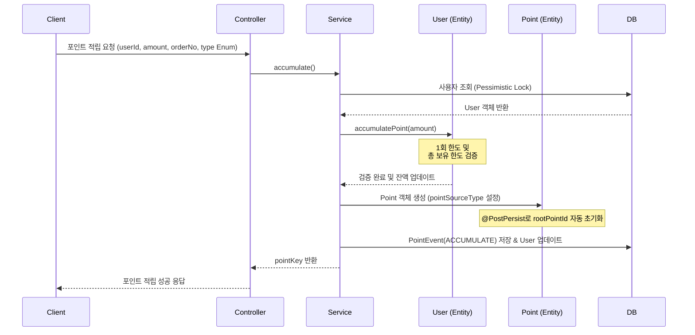
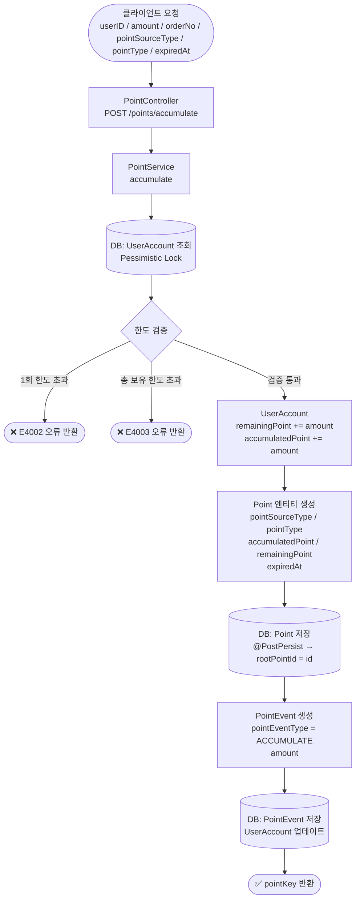
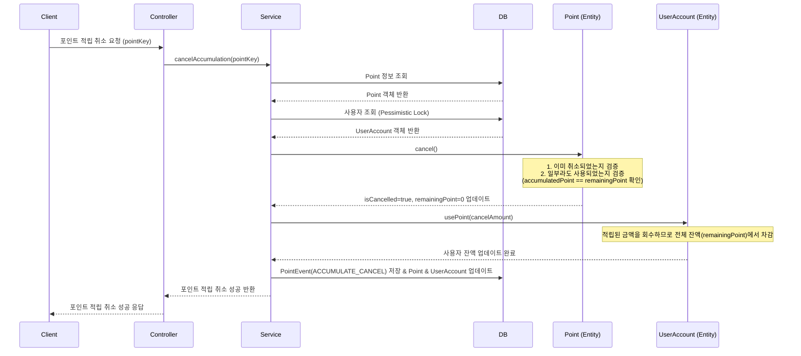
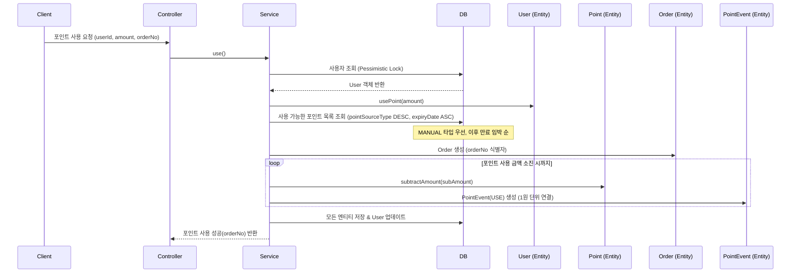
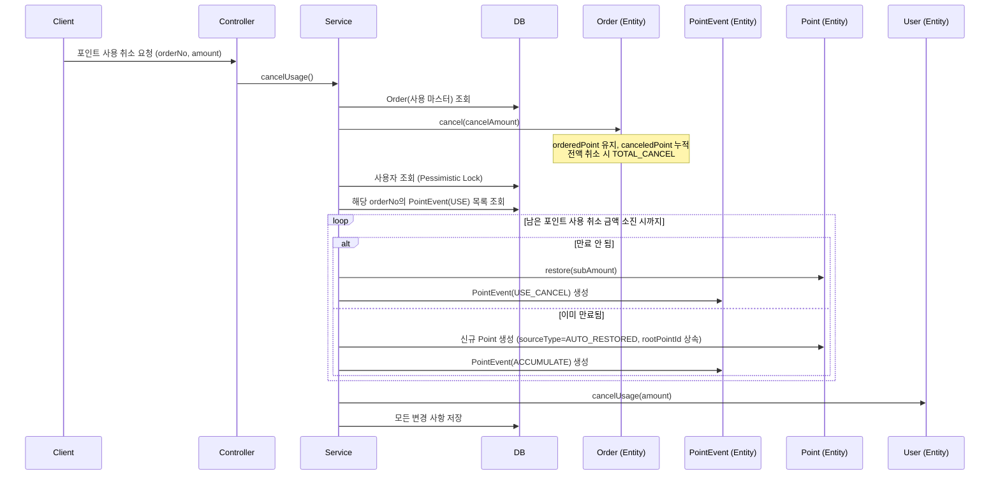

# 💰 무료 포인트 시스템 (API)

[](https://www.oracle.com/java/technologies/javase/jdk21-archive-downloads.html)
[](https://spring.io/projects/spring-boot)
[](http://www.h2database.com/)
[](https://gradle.org/)

---

### 💼 채용 포지션
- **Payments Platform Engineer**: [📄 채용 공고 및 안내 보기](docs/채용%20포지션.md)

### 📑 과제 정보
- **과제 요구사항**: [📄 요구사항 문서 보기](docs/요구사항.md)
- **핵심 목표**
  > **🎯 적립 단위(`pointKey`) 및 사용 단위(`orderNo`)의 상태 변화와 그 이력의 일관성을 끝까지 맞추는 시스템**

---

## 📖 목차
1. [빌드 및 실행 방법](#1-빌드-및-실행-방법)
2. [접속 정보](#2-접속-정보)
3. [데이터베이스 및 API 설계](#3-데이터베이스-및-api-설계)
4. [시스템 설계 공통 사항](#4-시스템-설계-공통-사항)
5. [아키텍처 구성](#5-아키텍처-구성)
6. [멱등성 및 데이터 정합성 설계](#6-멱등성-및-데이터-정합성-설계)
7. [부록: 무신사 도메인 특화 설계 고찰](#7-부록-무신사-도메인-특화-설계-고찰)

---

## 🚀 1. 빌드 및 실행 방법

### 1.1 빌드 방법
터미널에서 프로젝트 루트 디렉토리로 이동 후 아래 명령어를 실행합니다.
```bash
./gradlew clean build
```

### 1.2 실행 방법
빌드가 완료된 후 아래 명령어를 실행하여 애플리케이션을 구동합니다.
```bash
./gradlew bootRun
```
또는 생성된 jar 파일을 실행합니다.
```bash
java -jar build/libs/point-0.0.1-SNAPSHOT.jar
```

---

## 🌐 2. 접속 정보

### 2.1 서비스 접속
- **Swagger UI**: [🔗 http://localhost:8080/swagger-ui.html](http://localhost:8080/swagger-ui.html)
- **API Base URL**: `http://localhost:8080/points`

### 2.2 데이터베이스 접속 (H2 Console)
애플리케이션 실행 후 웹 브라우저에서 아래 정보로 데이터베이스에 접속할 수 있습니다.
- **H2 Console URL**: [🔗 http://localhost:8080/h2-console](http://localhost:8080/h2-console)
- **JDBC URL**: `jdbc:h2:mem:billing`
- **User Name**: `sa`
- **Password**: (입력 없음)

---

## 📐 3. 데이터베이스 및 API 설계

### 3.1 데이터베이스 설계 (ERD)
상세한 데이터베이스 설계 및 Mermaid 다이어그램은 아래 문서에서 확인할 수 있습니다.
- [📊 데이터베이스 설계 (ERD) 상세 문서](docs/데이터베이스%20설계.md)

### 3.2 API 명세
API 명세의 공통 사항 및 오류 코드 정의입니다.

#### [공통 응답 형식]
<details>
<summary>📖 공통 응답 형식 상세보기</summary>

모든 API는 아래와 같은 일관된 공통 응답 구조를 가집니다.

```json
{
  "code": "E0000",       // 응답 코드 (성공: E0000, 오류: E4XXX, E5XXX)
  "message": "성공",       // 응답 메시지
  "data": { ... }          // 실제 응답 데이터 (없을 경우 null)
}
```
</details>

#### [오류 코드 정의]
<details>
<summary>📖 오류 코드 정의 상세보기</summary>

| 분류 | 코드 | 메시지 | 설명 | HTTP 상태 |
| :--- | :--- | :--- | :--- | :--- |
| **성공** | `E0000` | 성공 | 요청이 정상적으로 처리됨 | 200 |
| **400** | `E4002` | 적립 금액은 1포인트 이상이어야 합니다. | 1P 미만 적립 시도 시 발생 | 400 |
| **400** | `E4003` | 1회 적립 가능 한도를 초과했습니다. | 시스템 또는 개인 적립 한도 초과 시 발생 | 400 |
| **400** | `E4004` | 취소 금액이 원본 금액을 초과할 수 없습니다. | 사용 취소 금액이 결제 금액보다 큰 때 발생 | 400 |
| **404** | `E4041` | 사용자를 찾을 수 없습니다. | 존재하지 않는 사용자 ID 요청 시 발생 | 404 |
| **404** | `E4042` | 적립 내역을 찾을 수 없습니다. | 존재하지 않는 pointKey 요청 시 발생 | 404 |
| **404** | `E4043` | 주문 내역을 찾을 수 없습니다. | 존재하지 않는 orderNo 요청 시 발생 | 404 |
| **409** | `E4091` | 보유 포인트가 부족합니다. | 사용 가능한 잔액보다 큰 금액 사용 시 발생 | 409 |
| **409** | `E4092` | 개인별 최대 보유 가능 포인트 한도를 초과했습니다. | 보유 한도(Max Retention) 초과 적립 시 발생 | 409 |
| **409** | `E4093` | 이미 사용된 금액이 있어 취소할 수 없습니다. | 적립 취소 시 이미 사용된 이력이 있을 때 발생 | 409 |
| **409** | `E4094` | 이미 취소된 내역입니다. | 이미 취소 처리된 건에 대해 중복 취소 시 발생 | 409 |
| **500** | `E5000` | 서버 내부 오류가 발생했습니다. | 시스템 내부 오류 발생 시 | 500 |

</details>

---

#### 1️⃣ 포인트 적립 API
<details>
<summary>📖 API 명세 및 처리 흐름 상세보기</summary>

사용자에게 포인트를 적립하며, 1회 최대 적립 한도 및 총 보유 한도를 검증합니다.

- **Method**: `POST`
- **Path**: `/points/accumulate`
- **Request Body**:
  ```json
  {
    "userId": "user1",
    "amount": 1000,
    "pointSourceType": "ACCUMULATION",
    "type": "FREE",
    "expiryDays": 365,
    "orderNo": "ORD202604010001"
  }
  ```
  > `pointSourceType` 허용 값: `ACCUMULATION`(일반 적립), `MANUAL`(수기 지급)
- **Response (Success)**:
  ```json
  {
    "code": "E0000",
    "message": "포인트 적립 성공",
    "data": {
      "pointKey": "20260331000001"
    }
  }
  ```

- **주요 오류 코드**: `E4041`, `E4002`, `E4003`, `E4092`

<details>
<summary>🔄 [시퀀스 다이어그램] 포인트 적립</summary>



---

**📊 데이터 플로우**



---

<details>
<summary>🗃️ 테이블 데이터 예시</summary>

> 요청: `userId=user1`, `amount=1000`, `orderNo=ORD001`, `pointSourceType=ACCUMULATION`, `type=FREE`, `expiryDays=365`

**POINT**

| id | pointKey | userId | accumulatedPoint | remainingPoint | pointType | pointSourceType | isCancelled | expiredAt | rootPointId | originPointId |
|----|----------|--------|-----------------|----------------|-----------|-----------------|-------------|-----------|-------------|---------------|
| 1 | 20260403000001 | user1 | 1000 | 1000 | FREE | ACCUMULATION | false | 2027-04-03 | 1 | null |

**POINT_EVENT**

| id | pointId | orderNo | pointEventType | amount |
|----|---------|---------|----------------|--------|
| 1 | 1 | ORD001 | ACCUMULATE | 1000 |

**USER_ACCOUNT**

| userId | remainingPoint | accumulatedPoint |
|--------|----------------|------------------|
| user1 | 1000 | 1000 |

</details>

</details>
</details>

---

#### 2️⃣ 포인트 적립 취소 API
<details>
<summary>📖 API 명세 및 처리 흐름 상세보기</summary>

적립된 포인트 전액을 취소합니다. 이미 사용된 포인트가 있는 경우 취소할 수 없습니다.

- **Method**: `POST`
- **Path**: `/points/accumulate/{pointKey}/cancel`
- **Request Body**: (Path Variable 사용)
- **Response (Success)**:
  ```json
  {
    "code": "E0000",
    "message": "포인트 적립 취소 성공",
    "data": null
  }
  ```

- **주요 오류 코드**: `E4042`, `E4041`, `E4093`, `E4094`

<details>
<summary>🔄 [시퀀스 다이어그램] 포인트 적립 취소</summary>



---

<details>
<summary>🗃️ 테이블 데이터 예시</summary>

> 요청: `pointKey=20260403000001` (적립 시 1000P, 미사용 상태)

**POINT** (변경)

| id | pointKey | accumulatedPoint | remainingPoint | isCancelled |
|----|----------|-----------------|----------------|-------------|
| 1 | 20260403000001 | 1000 | ~~1000~~ → **0** | ~~false~~ → **true** |

**POINT_EVENT** (신규 추가)

| id | pointId | orderNo | pointEventType | amount |
|----|---------|---------|----------------|--------|
| 2 | 1 | null | ACCUMULATE_CANCEL | 1000 |

**USER_ACCOUNT** (변경)

| userId | remainingPoint | accumulatedPoint |
|--------|----------------|------------------|
| user1 | ~~1000~~ → **0** | ~~1000~~ → **0** |

</details>

</details>
</details>

---

#### 3️⃣ 포인트 사용 API
<details>
<summary>📖 API 명세 및 처리 흐름 상세보기</summary>

주문에 필요한 포인트를 차감하며, 관리자 수기 포인트 및 만료 임박 포인트가 우선적으로 사용됩니다.

- **Method**: `POST`
- **Path**: `/points/use`
- **Request Body**:
  ```json
  {
    "userId": "user1",
    "orderNo": "A1234",
    "amount": 500
  }
  ```
- **Response (Success)**:
  ```json
  {
    "code": "E0000",
    "message": "포인트 사용 성공",
    "data": {
      "pointKey": "A1234"  // 사용된 주문 번호(orderNo) 반환
    }
  }
  ```

- **주요 오류 코드**: `E4041`, `E4091`

<details>
<summary>🔄 [시퀀스 다이어그램] 포인트 사용</summary>



---

<details>
<summary>🗃️ 테이블 데이터 예시</summary>

> 요청: `userId=user1`, `orderNo=A1234`, `amount=1500` (보유 포인트: FREE 1000P + FREE 800P)

**POINT** (변경)

| id | pointKey | accumulatedPoint | remainingPoint | pointSourceType |
|----|----------|-----------------|----------------|------------------|
| 1 | 20260403000001 | 1000 | ~~1000~~ → **0** | ACCUMULATION |
| 2 | 20260403000002 | 800 | ~~800~~ → **300** | ACCUMULATION |

**ORDER** (신규 추가)

| id | orderNo | userId | orderedPoint | canceledPoint | orderType |
|----|---------|--------|-------------|---------------|----------|
| 1 | A1234 | user1 | 1500 | 0 | NORMAL |

**POINT_EVENT** (신규 추가)

| id | pointId | orderNo | pointEventType | amount |
|----|---------|---------|----------------|--------|
| 3 | 1 | A1234 | USE | 1000 |
| 4 | 2 | A1234 | USE | 500 |

**USER_ACCOUNT** (변경)

| userId | remainingPoint | usedPoint |
|--------|----------------|----------|
| user1 | ~~1800~~ → **300** | ~~0~~ → **1500** |

</details>

</details>
</details>

---

#### 4️⃣ 포인트 사용 취소 API
<details>
<summary>📖 API 명세 및 처리 흐름 상세보기</summary>

사용된 포인트의 전액 또는 일부를 취소합니다. 이미 만료된 포인트는 신규 적립 처리됩니다.

- **Method**: `POST`
- **Path**: `/points/use/{orderNo}/cancel`
- **Request Body**:
  ```json
  {
    "amount": 500
  }
  ```
- **Response (Success)**:
  ```json
  {
    "code": "E0000",
    "message": "포인트 사용 취소 성공",
    "data": null
  }
  ```

- **주요 오류 코드**: `E4043`, `E4041`, `E4004`

<details>
<summary>🔄 [시퀀스 다이어그램] 포인트 사용 취소</summary>



---

<details>
<summary>🗃️ 테이블 데이터 예시</summary>

> 요청: `orderNo=A1234`, `amount=500` (부분 취소, 위 사용 예시 이후 상태)

**ORDER** (변경)

| id | orderNo | orderedPoint | canceledPoint | orderType |
|----|---------|-------------|---------------|----------|
| 1 | A1234 | 1500 | ~~0~~ → **500** | ~~NORMAL~~ → **PARTIAL_CANCEL** |

**POINT** (변경)

| id | pointKey | remainingPoint | isCancelled |
|----|----------|----------------|-------------|
| 2 | 20260403000002 | ~~300~~ → **800** | false |

**POINT_EVENT** (신규 추가)

| id | pointId | orderNo | pointEventType | amount |
|----|---------|---------|----------------|--------|
| 5 | 2 | A1234 | USE_CANCEL | 500 |

**USER_ACCOUNT** (변경)

| userId | remainingPoint | usedPoint |
|--------|----------------|----------|
| user1 | ~~300~~ → **800** | ~~1500~~ → **1000** |

> 💡 만료된 포인트 취소 시: 원본 복구 대신 `sourceType=AUTO_RESTORED`인 신규 Point가 생성되고 `ACCUMULATE` 이벤트가 기록됩니다. 신규 Point는 원본의 `rootPointId`를 상속합니다.

</details>

</details>
</details>

---

### 3.3 핵심 비즈니스 로직 및 정책
- **✨ 포인트 사용 우선순위**: 
  - `MANUAL`(수기 지급) 포인트를 최우선으로 사용합니다.
  - 그 다음 만료일이 임박한 순서(`expiryDate ASC`)로 자동 차감됩니다.
- **🔍 이벤트 기반 이력 추적**: 
  - `PointEvent` 테이블에 `ACCUMULATE`, `USE`, `USE_CANCEL`, `ACCUMULATE_CANCEL`, `EXPIRE`, `ACCUMULATE` 타입으로 모든 포인트 활동을 기록합니다.
  - 하나의 사용 건이 어떤 적립 건들에서 얼마씩 차감되었는지 1원 단위로 정밀하게 추적할 수 있습니다.
- **🌳 포인트 계보 추적 (`rootPointId`)**: 
  - 모든 포인트는 `rootPointId`를 보유하며, 만료 후 재적립된 포인트도 원본의 `rootPointId`를 상속합니다.
  - 재귀 쿼리 없이 `rootPointId` 단일 조건으로 전체 적립 계보를 조회할 수 있습니다.
- **♻️ 만료 포인트 자동 신규 적립**: 
  - 사용 취소 시점에 이미 만료된 포인트는 원본 복구가 아닌, `AUTO_RESTORED` 타입의 신규 포인트로 자동 적립 처리됩니다.
  - 신규 적립 포인트는 원본의 `rootPointId`를 상속하여 계보가 유지됩니다.
- **🧪 시나리오 검증**: 
  - 요구사항 예시 시나리오에 따른 데이터 변화는 [🔍 시나리오 흐름 문서](docs/시나리오%20흐름.md)에서 확인할 수 있습니다.
  - 실제 동작은 [💻 시나리오 테스트 코드 (JUnit 5)](src/test/java/org/musinsa/payments/point/scenario/PointScenarioTest.java)를 통해 검증되었습니다.

---

---

## 🛠 4. 시스템 설계 공통 사항

### 4.1 예외 처리 방식 (Exception Handling)
- **`BusinessException`**: 비즈니스 로직 위반 시 발생하는 커스텀 예외입니다. `ResultCode`를 통해 에러 코드와 HTTP 상태 코드를 관리합니다.
- **`GlobalExceptionHandler`**: `@RestControllerAdvice`를 사용하여 모든 예외를 전역적으로 포착하고, 일관된 `ApiResponse` 형식으로 응답합니다.
  - 예상치 못한 서버 오류는 `500 Internal Server Error`로 처리하며 보안을 위해 상세 에러는 로그에만 남깁니다.

**코드 예시 (GlobalExceptionHandler.java):**
```java
@ExceptionHandler(BusinessException.class)
public ResponseEntity<ApiResponse<Void>> handleBusinessException(BusinessException e) {
    log.warn("[EXCEPTION] BusinessException: {} - {} | Code: {}", 
            e.getResultCode(), e.getMessage(), e.getResultCode().getCode());
    ResultCode resultCode = e.getResultCode();
    return ResponseEntity
            .status(resultCode.getHttpStatus())
            .body(ApiResponse.error(resultCode, e.getMessage()));
}
```

### 4.2 유효성 검증 방식 (Validation)
- **DTO 레벨 검증**: Jakarta Bean Validation(`@NotBlank`, `@Min`, `@NotNull` 등)을 사용하여 API 입력 단계에서 1차 검증을 수행합니다.
- **도메인 레벨 검증**: 엔티티 내부에서 비즈니스 규칙(예: 보유 한도 초과, 사용 금액 초과 등)을 직접 검증하여 데이터의 정합성을 보장합니다.

**코드 예시 (PointDto.java / User.java):**
```java
// DTO 검증
public static class AccumulateRequest {
    @NotNull(message = "적립 금액은 필수입니다.")
    @Min(value = 1, message = "적립 금액은 최소 1P 이상이어야 합니다.")
    private Long amount;
}

// 도메인 검증 (UserAccount.java)
public void accumulatePoint(Long amount, PointType type) {
    if (amount > this.maxAccumulationPoint) {
        throw new BusinessException(ResultCode.ACCUMULATION_LIMIT_EXCEEDED, "1회 적립 가능 한도 초과");
    }
    if (this.remainingPoint + amount > this.maxRetentionPoint) {
        throw new BusinessException(ResultCode.RETENTION_LIMIT_EXCEEDED, "개인별 최대 보유 가능 포인트 초과");
    }
}
```

### 4.3 로깅 및 추적 방식 (Logging & Trace)
- **`ApiLoggingFilter`**: 모든 API의 요청(Method, URI, Body)과 응답(Status, Duration, Body)을 자동으로 로깅하여 이슈 발생 시 추적성을 확보합니다.
- **식별 키 기반 추적**: `pointKey`를 통해 적립-사용-취소로 이어지는 전체 라이프사이클을 추적할 수 있습니다.

**코드 예시 (ApiLoggingFilter.java):**
```java
private void logResponse(ContentCachingResponseWrapper response, long duration) {
    int status = response.getStatus();
    String payload = new String(response.getContentAsByteArray());
    log.info("[RESPONSE] Status: {} | Duration: {}ms | Body: {}", 
            status, duration, payload);
}
```

---

## 🏗 5. 아키텍처 구성
AWS 기반 아키텍처 구성도는 `docs/아키텍처 구성.md` 파일을 통해 Mermaid 다이어그램으로 확인할 수 있습니다.
- [☁️ AWS 아키텍처 상세 보기 (EKS, ALB, Aurora)](docs/아키텍처%20구성.md)

---

## 🔒 6. 멱등성 및 데이터 정합성 설계
데이터 정합성을 보장하기 위한 멱등성 및 동시성 제어 전략은 아래 문서에서 확인할 수 있습니다.
- [🔐 멱등성 및 데이터 정합성 설계 상세 문서](docs/동시성%20제어.md)

---

## 📎 7. 부록: 무신사 도메인 특화 설계 고찰

본 과제에서는 핵심적인 포인트 비즈니스 로직과 데이터 정합성에 집중하였습니다. 실제 무신사와 같은 대규모 이커머스 환경에서 더욱 견고하고 확장 가능한 시스템을 구축하기 위해 다음과 같은 요소들을 추가로 고려할 수 있습니다.

### 적립 근거(Origin) 추적 및 확장성 있는 ERD 설계
무신사의 특성상 포인트는 단순히 '금액'만 적립되는 것이 아니라, 다양한 사용자 활동(주문 구매, 리뷰 작성, 등급 혜택, 이벤트 참여 등)에 근거하여 발생합니다. 이를 위해 `Point` 테이블은 어떤 근거에 의해 포인트가 생성되었는지 추적할 수 있는 구조가 필요합니다.

- **적립 원천 식별 (Origin Key)**: `orderNo`(주문 번호), `reviewId`(리뷰 ID), `userGrade`(사용자 등급 정책 ID) 등 각 도메인별 고유 식별자를 외래키 또는 논리적 키로 보유하여 적립의 근거를 명확히 합니다.
- **다양한 적립 정책 관리**: 등급별 구매 적립률(%), 상품 카테고리별 추가 적립금 등 복잡한 비즈니스 규칙을 `PointPolicy`와 같은 별도 테이블로 관리하고, 적립 시점에 적용된 정책 ID를 기록하여 사후 정산 및 데이터 분석에 활용할 수 있습니다.
- **확장 가능한 데이터 모델링**: 새로운 적립 수단이 추가되더라도 기존 스키마를 크게 변경하지 않도록 `originType` (ORDER, REVIEW, EVENT 등) 컬럼을 활용한 전략 패턴 기반의 모델 설계를 고려할 수 있습니다.

### [설계 시 고려 및 제외 사항]
무신사 도메인 서비스를 고려했을 때, 실제 운영 환경에서는 다음과 같은 복잡한 도메인 영역이 존재할 것으로 예상되나 본 과제에서는 포인트 시스템의 핵심 로직과 데이터 정합성 검증에 집중하기 위해 설계를 단순화하거나 제외하였습니다.

- **아이템 단위 부분 취소 제외**: 실제로는 주문(Order) 내 상품(Item) 단위의 부분 취소가 발생할 수 있으나, 본 설계에서는 복잡도를 낮추기 위해 주문 단위의 처리에 집중하고 Item 엔티티는 설계하지 않았습니다.
- **유료 포인트 적립 프로세스 제외**: 실제로는 PG 결제 완료 후 Webhook 처리를 통해 유료 포인트가 적립되는 흐름이 일반적이나, 본 과제에서는 포인트 시스템의 핵심 로직 검증을 위해 외부 연동 부분은 제외했습니다.
- **무료 포인트의 데이터 흐름과 정합성**: 이번 설계에서는 무료 포인트의 적립, 사용, 만료, 취소 과정에서 발생하는 데이터 흐름과 금액의 정합성을 맞추는 데 가장 큰 초점을 맞추었습니다.
