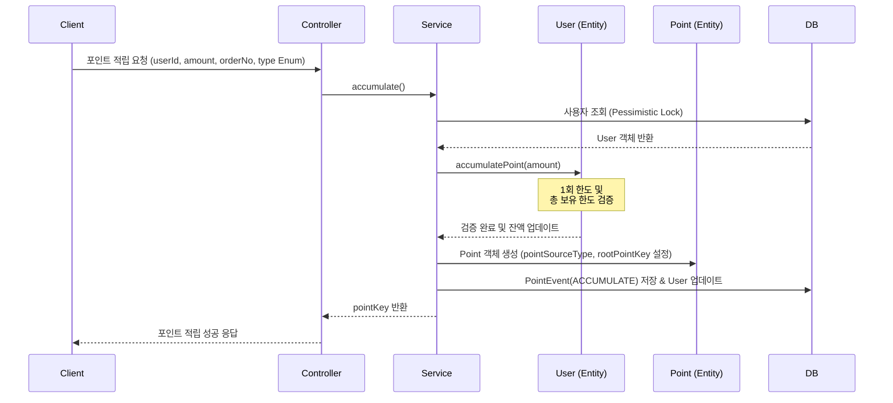
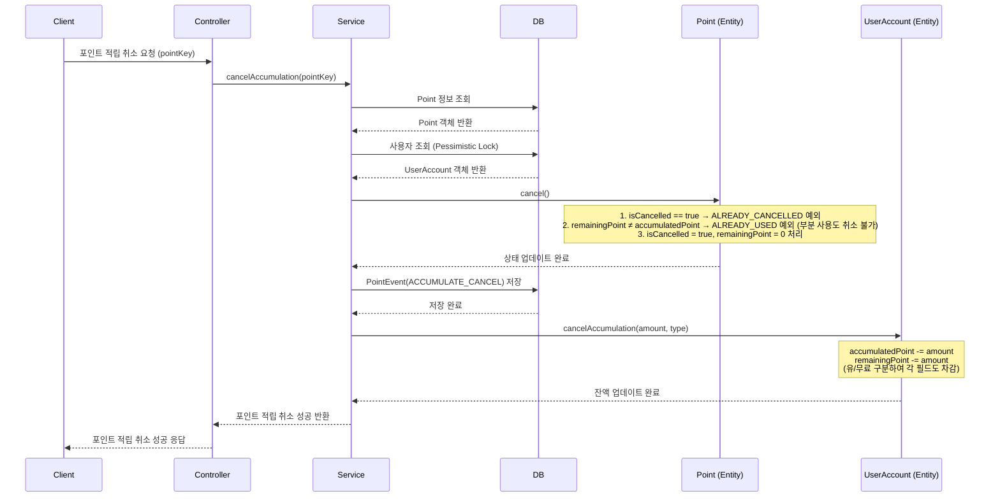
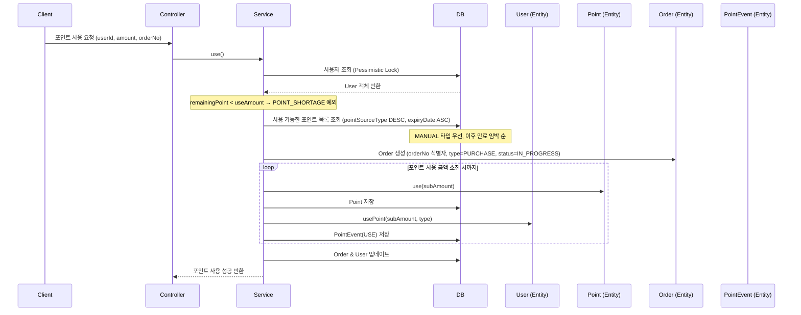
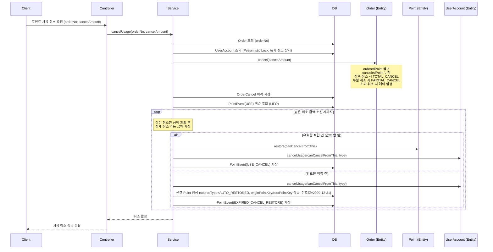

# 💰 무료 포인트 시스템 (API)

[](https://www.oracle.com/java/technologies/javase/jdk21-archive-downloads.html)
[](https://spring.io/projects/spring-boot)
[](http://www.h2database.com/)
[](https://gradle.org/)

---

### 💼 채용 포지션
- **Payments Platform Engineer**: [📄 채용 공고 및 안내 보기](docs/채용%20포지션.md)

### 📑 과제 정보
- **과제 요구사항**: [📄 요구사항 문서 보기](docs/요구사항.md)
- **핵심 목표**
  > **🎯 적립 단위(`pointKey`) 및 사용 단위(`orderNo`)의 상태 변화와 그 이력의 일관성을 끝까지 맞추는 시스템**

- **과제를 보며 중점으로 잡은 포인트**

  1. **모든 포인트에는 적립 이후 종결까지 로직적으로 꼬리표가 달려있어야 한다.**
     - 각 포인트 건(`pointKey`)은 적립 → 사용 → 취소/만료에 이르는 전 생애주기 동안 `PointEvent`를 통해 추적 가능해야 한다.
     - 사용 취소 시 만료된 포인트가 끼어있는 경우에도 `EXPIRED_CANCEL_RESTORE` 이벤트로 재지급 이력을 남겨, 추적 고리가 끊기지 않도록 설계했다.

  2. **데이터 정합성 — 동시성과 멱등성**
     - 동일 사용자에 대한 포인트 적립·사용 요청이 동시에 들어올 경우 `UserAccount`의 잔액(`remainingPoint`)이 오염될 수 있다.
     - **DB 비관적 락(`SELECT FOR UPDATE`)** 으로 동일 사용자에 대한 요청을 직렬화하여 잔액 정합성을 보장했다. Redis 분산 락도 고민했으나, 외부 인프라 의존 없이 정합성을 우선하는 현 과제 범위에서는 DB 락이 더 적합하다고 판단했다.
     - 멱등성 측면에서는 `orderNo`에 `unique` 제약을 걸어 동일 주문에 대한 중복 사용을 DB 레벨에서 방어했고, 적립 취소·사용 취소 시에도 `isCancelled` 상태 검증으로 중복 처리를 차단했다.

---

## 📖 목차
1. [빌드 및 실행 방법](#1-빌드-및-실행-방법)
2. [접속 정보](#2-접속-정보)
3. [데이터베이스 및 API 설계](#3-데이터베이스-및-api-설계)
4. [시스템 설계 공통 사항](#4-시스템-설계-공통-사항)
5. [Admin 관리 화면](#5-admin-관리-화면)
6. [아키텍처 구성](#6-아키텍처-구성)

---

## 🚀 1. 빌드 및 실행 방법

### 1.1 빌드 방법
터미널에서 프로젝트 루트 디렉토리로 이동 후 아래 명령어를 실행합니다.
```bash
./gradlew clean build
```

### 1.2 실행 방법
빌드가 완료된 후 아래 명령어를 실행하여 애플리케이션을 구동합니다.
```bash
./gradlew bootRun
```
또는 생성된 jar 파일을 실행합니다.
```bash
java -jar build/libs/point-0.0.1-SNAPSHOT.jar
```

---

## 🌐 2. 접속 정보

### 2.1 서비스 접속
- **Swagger UI**: [🔗 http://localhost:8080/swagger-ui.html](http://localhost:8080/swagger-ui.html)
- **API Base URL**: `http://localhost:8080/points`
- **Admin UI**: [🔗 http://localhost:8080/admin](http://localhost:8080/admin)
  - 사용자 계정: `/admin/accounts`
  - 포인트 적립 내역: `/admin/points`
  - 포인트 사용 내역: `/admin/orders`
  - 통계 (일별/월별/연도별): `/admin/stats`

### 2.2 데이터베이스 접속 (H2 Console)
애플리케이션 실행 후 웹 브라우저에서 아래 정보로 데이터베이스에 접속할 수 있습니다.
- **H2 Console URL**: [🔗 http://localhost:8080/h2-console](http://localhost:8080/h2-console)
- **JDBC URL**: `jdbc:h2:file:./data/billing`
- **User Name**: `sa`
- **Password**: (입력 없음)

---

## 📐 3. 데이터베이스 및 API 설계

### 3.1 데이터베이스 설계 (ERD)
상세한 데이터베이스 설계 및 Mermaid 다이어그램은 아래 문서에서 확인할 수 있습니다.
- [📊 데이터베이스 설계 (ERD) 상세 문서](docs/데이터베이스%20설계.md)

### 3.2 API 명세
API 명세의 공통 사항 및 오류 코드 정의입니다.

#### [공통 응답 형식]
<details>
<summary>📖 공통 응답 형식 상세보기</summary>

모든 API는 아래와 같은 일관된 공통 응답 구조를 가집니다.

```json
{
  "code": "E0000",       // 응답 코드 (성공: E0000, 오류: E4XXX, E5XXX)
  "message": "성공",       // 응답 메시지
  "data": { ... }          // 실제 응답 데이터 (없을 경우 null)
}
```
</details>

#### [오류 코드 정의]
<details>
<summary>📖 오류 코드 정의 상세보기</summary>

| 분류 | 코드 | 메시지 | 설명 | HTTP 상태 |
| :--- | :--- | :--- | :--- | :--- |
| **성공** | `E0000` | 성공 | 요청이 정상적으로 처리됨 | 200 |
| **400** | `E4002` | 적립 금액은 1포인트 이상이어야 합니다. | 1P 미만 적립 시도 시 발생 | 400 |
| **400** | `E4003` | 1회 적립 가능 한도를 초과했습니다. | 시스템 또는 개인 적립 한도 초과 시 발생 | 400 |
| **400** | `E4004` | 취소 금액이 원본 금액을 초과할 수 없습니다. | 사용 취소 금액이 결제 금액보다 큰 때 발생 | 400 |
| **404** | `E4041` | 사용자를 찾을 수 없습니다. | 존재하지 않는 사용자 ID 요청 시 발생 | 404 |
| **404** | `E4042` | 적립 내역을 찾을 수 없습니다. | 존재하지 않는 pointKey 요청 시 발생 | 404 |
| **404** | `E4043` | 주문 내역을 찾을 수 없습니다. | 존재하지 않는 orderNo 요청 시 발생 | 404 |
| **409** | `E4091` | 보유 포인트가 부족합니다. | 사용 가능한 잔액보다 큰 금액 사용 시 발생 | 409 |
| **409** | `E4092` | 개인별 최대 보유 가능 포인트 한도를 초과했습니다. | 보유 한도(Max Retention) 초과 적립 시 발생 | 409 |
| **409** | `E4093` | 이미 사용된 금액이 있어 취소할 수 없습니다. | 적립 취소 시 이미 사용된 이력이 있을 때 발생 | 409 |
| **409** | `E4094` | 이미 취소된 내역입니다. | 이미 취소 처리된 건에 대해 중복 취소 시 발생 | 409 |
| **500** | `E5000` | 서버 내부 오류가 발생했습니다. | 시스템 내부 오류 발생 시 | 500 |

</details>

---

#### 1️⃣ 포인트 적립 API
<details>
<summary>📖 API 명세 상세보기</summary>

사용자에게 포인트를 적립하며, 1회 최대 적립 한도 및 총 보유 한도를 검증합니다.

| 항목 | 내용 |
| :--- | :--- |
| **Method** | `POST` |
| **Path** | `/points/accumulate` |
| **Content-Type** | `application/json` |

**Request Body**

| 필드 | 타입 | 필수 | 설명 |
| :--- | :--- | :---: | :--- |
| `userId` | String | ✅ | 사용자 ID |
| `amount` | Long | ✅ | 적립 포인트 (1 이상, 시스템 한도 이하) |
| `pointSourceType` | String | ✅ | `ACCUMULATION`(일반 적립) / `MANUAL`(수기 지급) |
| `type` | String | ✅ | 포인트 유형 (`FREE`) |
| `expiryDays` | Integer | ❌ | 만료일 (미입력 시 기본값: 2999-12-31) |
| `orderNo` | String | ❌ | 연관 주문 번호 |

**Response Body (`data`)**

| 필드 | 타입 | 설명 |
| :--- | :--- | :--- |
| `pointKey` | String | 생성된 포인트 키 (적립 식별자) |

**Sample Request**
```json
{
  "userId": "user1",
  "amount": 1000,
  "pointSourceType": "ACCUMULATION",
  "type": "FREE",
  "expiryDays": 365,
  "orderNo": "ORD202604010001"
}
```

**Sample Response**
```json
{
  "code": "E0000",
  "message": "적립 성공",
  "data": {
    "pointKey": "20260331000001"
  }
}
```

**오류 응답**

| 코드 | 메시지 | 설명 |
| :--- | :--- | :--- |
| `E4041` | 사용자를 찾을 수 없습니다. | 존재하지 않는 userId |
| `E4002` | 적립 금액은 1포인트 이상이어야 합니다. | 최소 금액 미달 |
| `E4003` | 1회 적립 가능 한도를 초과했습니다. | 적립 한도 초과 |
| `E4092` | 개인별 최대 보유 가능 포인트 한도를 초과했습니다. | 보유 한도 초과 |

</details>

<details>
<summary>🔄 시퀀스 다이어그램 & 주요 로직/정책 — 포인트 적립</summary>



> **💡 주요 로직 & 정책**
> - 사용자 조회 시 **Pessimistic Lock**을 적용하여 동시 적립 요청에 의한 보유 한도 초과를 방지합니다.
> - `UserAccount.accumulatePoint()` 내부에서 **1회 적립 한도** 및 **개인 최대 보유 한도**를 검증합니다.
> - `Point` 엔티티 생성 시 `rootPointKey`는 `doAccumulate()` 내부에서 직접 설정됩니다. `@PostPersist`는 `rootPointKey`가 null인 경우에만 동작하는 fallback입니다.
> - `pointSourceType`이 `MANUAL`인 경우 수기 지급으로 식별되어 사용 시 최우선 차감됩니다.

</details>

<details>
<summary>🗃️ 테이블 데이터 예시</summary>

> 요청: `userId=user1`, `amount=1000`, `orderNo=ORD001`, `pointSourceType=ACCUMULATION`, `type=FREE`, `expiryDays=365`

**POINT**

| id | pointKey | userId | accumulatedPoint | remainingPoint | type | pointSourceType | isCancelled | expiryDateTime | rootPointKey | originPointKey |
|----|----------|--------|-----------------|----------------|------|-----------------|-------------|----------------|--------------|---------------|
| 1 | 20260403000001 | user1 | 1000 | 1000 | FREE | ACCUMULATION | false | 2027-04-03T23:59:59 | 20260403000001 | null |

**POINT_EVENT**

| id | point_accumulation_id | pointEventType | amount |
|----|-----------------------|----------------|--------|
| 1 | 1 | ACCUMULATE | 1000 |

**USER_ACCOUNT**

| userId | remainingPoint | accumulatedPoint |
|--------|----------------|------------------|
| user1 | 1000 | 1000 |

</details>

---

#### 2️⃣ 포인트 적립 취소 API
<details>
<summary>📖 API 명세 상세보기</summary>

적립된 포인트 전액을 취소합니다. 이미 사용된 포인트가 있는 경우 취소할 수 없습니다.

| 항목 | 내용 |
| :--- | :--- |
| **Method** | `POST` |
| **Path** | `/points/accumulate/{pointKey}/cancel` |
| **Content-Type** | `-` (Path Variable만 사용) |

**Path Variable**

| 필드 | 타입 | 필수 | 설명 |
| :--- | :--- | :---: | :--- |
| `pointKey` | String | ✅ | 취소할 적립 건의 포인트 키 |

**Response Body (`data`)**

| 필드 | 타입 | 설명 |
| :--- | :--- | :--- |
| — | — | 없음 (`null`) |

**Sample Response**
```json
{
  "code": "E0000",
  "message": "적립 취소 성공",
  "data": null
}
```

**오류 응답**

| 코드 | 메시지 | 설명 |
| :--- | :--- | :--- |
| `E4042` | 적립 내역을 찾을 수 없습니다. | 존재하지 않는 pointKey |
| `E4041` | 사용자를 찾을 수 없습니다. | 존재하지 않는 userId |
| `E4093` | 이미 사용된 금액이 있어 취소할 수 없습니다. | 이미 사용된 포인트 존재 |
| `E4094` | 이미 취소된 내역입니다. | 중복 취소 시도 |

</details>

<details>
<summary>🔄 시퀀스 다이어그램 & 주요 로직/정책 — 포인트 적립 취소</summary>



> **💡 주요 로직 & 정책**
> - `Point.cancel()` 내부에서 `isCancelled == true`이면 **중복 취소 예외**, `remainingPoint != accumulatedPoint`이면 **이미 사용된 포인트 예외**를 발생시킵니다. (부분 사용된 경우도 취소 불가)
> - 취소 성공 시 `remainingPoint = 0`, `isCancelled = true`로 변경되며 `PointEvent(ACCUMULATE_CANCEL)`이 기록됩니다.
> - `UserAccount`의 `accumulatedPoint`와 `remainingPoint`가 함께 차감됩니다.

</details>

<details>
<summary>🗃️ 테이블 데이터 예시</summary>

> 요청: `pointKey=20260403000001` (적립 시 1000P, 미사용 상태)

**POINT** (변경)

| id | pointKey | accumulatedPoint | remainingPoint | isCancelled |
|----|----------|-----------------|----------------|-------------|
| 1 | 20260403000001 | 1000 | ~~1000~~ → **0** | ~~false~~ → **true** |

**POINT_EVENT** (기존 + 신규 추가)
| id | point_accumulation_id | pointEventType | amount |
|----|-----------------------|----------------|--------|
| 1 | 1 | ACCUMULATE | 1000 |
| 2 | 1 | ACCUMULATE_CANCEL | 1000 |

**USER_ACCOUNT** (변경)

| userId | remainingPoint | accumulatedPoint |
|--------|----------------|------------------|
| user1 | ~~1000~~ → **0** | ~~1000~~ → **0** |

</details>

---

#### 3️⃣ 포인트 사용 API
<details>
<summary>📖 API 명세 상세보기</summary>

주문에 필요한 포인트를 차감하며, 관리자 수기 포인트 및 만료 임박 포인트가 우선적으로 사용됩니다.

| 항목 | 내용 |
| :--- | :--- |
| **Method** | `POST` |
| **Path** | `/points/use` |
| **Content-Type** | `application/json` |

**Request Body**

| 필드 | 타입 | 필수 | 설명 |
| :--- | :--- | :---: | :--- |
| `userId` | String | ✅ | 사용자 ID |
| `orderNo` | String | ✅ | 주문 번호 (식별자) |
| `amount` | Long | ✅ | 사용할 포인트 금액 |

**Response Body (`data`)**

없음 (`data: null`)

**Sample Request**
```json
{
  "userId": "user1",
  "orderNo": "A1234",
  "amount": 500
}
```

**Sample Response**
```json
{
  "code": "E0000",
  "message": "사용 성공",
  "data": null
}
```

**오류 응답**

| 코드 | 메시지 | 설명 |
| :--- | :--- | :--- |
| `E4041` | 사용자를 찾을 수 없습니다. | 존재하지 않는 userId |
| `E4091` | 보유 포인트가 부족합니다. | 잔액 부족 |

</details>

<details>
<summary>🔄 시퀀스 다이어그램 & 주요 로직/정책 — 포인트 사용</summary>



> **💡 주요 로직 & 정책**
> - 사용 가능한 포인트는 **`MANUAL` 타입 우선, 이후 만료일 임박 순(`expiryDate ASC`)**으로 자동 정렬되어 차감됩니다.
> - 하나의 사용 건이 여러 적립 건에서 차감될 경우, `PointEvent(USE)`가 적립 건별로 **1원 단위**로 분리 기록됩니다.
> - `Order` 엔티티는 `orderNo`를 유니크 식별자로 사용하며, 중복 주문 번호 요청 시 예외가 발생합니다.

</details>

<details>
<summary>🗃️ 테이블 데이터 예시</summary>

> 요청: `userId=user1`, `orderNo=A1234`, `amount=1500` (보유 포인트: FREE 1000P + FREE 800P)

**POINT** (변경)

| id | pointKey | accumulatedPoint | remainingPoint | pointSourceType |
|----|----------|-----------------|----------------|------------------|
| 1 | 20260403000001 | 1000 | ~~1000~~ → **0** | ACCUMULATION |
| 2 | 20260403000002 | 800 | ~~800~~ → **300** | ACCUMULATION |

**ORDER** (신규 추가)

| id | orderNo | userId | orderedPoint | canceledPoint | type | status |
|----|---------|--------|-------------|---------------|------|--------|
| 1 | A1234 | user1 | 1500 | 0 | PURCHASE | IN_PROGRESS |

**POINT_EVENT** (신규 추가)

| id | pointId | orderNo | pointEventType | amount |
|----|---------|---------|----------------|--------|
| 3 | 1 | A1234 | USE | 1000 |
| 4 | 2 | A1234 | USE | 500 |

**USER_ACCOUNT** (변경)

| userId | remainingPoint | usedPoint |
|--------|----------------|----------|
| user1 | ~~1800~~ → **300** | ~~0~~ → **1500** |

</details>

---

#### 4️⃣ 포인트 사용 취소 API
<details>
<summary>📖 API 명세 상세보기</summary>

사용된 포인트의 전액 또는 일부를 취소합니다. 이미 만료된 포인트는 신규 적립 처리됩니다.

| 항목 | 내용 |
| :--- | :--- |
| **Method** | `POST` |
| **Path** | `/points/use/{orderNo}/cancel` |
| **Content-Type** | `application/json` |

**Path Variable**

| 필드 | 타입 | 필수 | 설명 |
| :--- | :--- | :---: | :--- |
| `orderNo` | String | ✅ | 취소할 주문 번호 |

**Request Body**

| 필드 | 타입 | 필수 | 설명 |
| :--- | :--- | :---: | :--- |
| `amount` | Long | ✅ | 취소할 포인트 금액 (전액 또는 일부) |

**Response Body (`data`)**

| 필드 | 타입 | 설명 |
| :--- | :--- | :--- |
| — | — | 없음 (`null`) |

**Sample Request**
```json
{
  "amount": 500
}
```

**Sample Response**
```json
{
  "code": "E0000",
  "message": "사용 취소 성공",
  "data": null
}
```

**오류 응답**

| 코드 | 메시지 | 설명 |
| :--- | :--- | :--- |
| `E4043` | 주문 내역을 찾을 수 없습니다. | 존재하지 않는 orderNo |
| `E4041` | 사용자를 찾을 수 없습니다. | 존재하지 않는 userId |
| `E4004` | 취소 금액이 원본 금액을 초과할 수 없습니다. | 취소 금액 초과 |

</details>

<details>
<summary>🔄 시퀀스 다이어그램 & 주요 로직/정책 — 포인트 사용 취소</summary>



> **💡 주요 로직 & 정책**
> - `PointEvent(USE)` 이력을 **역순(LIFO)**으로 조회하여 가장 최근에 사용된 적립 건부터 순서대로 복구합니다.
> - 복구 대상 적립 건이 **만료된 경우**, 원본 복구 대신 `AUTO_RESTORED` 타입의 신규 포인트를 생성하며 원본의 `rootPointKey`를 상속합니다. 이 경우 `USE_CANCEL` 이벤트는 기록되지 않고 `EXPIRED_CANCEL_RESTORE` 이벤트만 기록됩니다.
> - `Order.cancel()`에서 `canceledPoint`를 누적하며, 전액 취소 시 `TOTAL_CANCEL`, 부분 취소 시 `PARTIAL_CANCEL` 상태로 변경됩니다.
> - `OrderCancel` 이력에 취소 금액과 일시가 별도 기록됩니다.

</details>

<details>
<summary>🗃️ 테이블 데이터 예시</summary>

#### Case 1. 부분 취소 (유효한 포인트)
> 요청: `orderNo=A1234`, `cancelAmount=500`  
> 위 사용 예시 이후 상태 (1500P 사용, remainingPoint=300)

**ORDER** (변경)

| id | orderNo | orderedPoint | canceledPoint | type | status |
|----|---------|-------------|---------------|------|--------|
| 1 | A1234 | 1500 | ~~0~~ → **500** | ~~PURCHASE~~ → **PARTIAL_CANCEL** | IN_PROGRESS |

**POINT** (변경)

| id | pointKey | remainingPoint | isExpired |
|----|----------|----------------|-----------|
| 2 | 20260403000002 | ~~300~~ → **800** | false |

**POINT_EVENT** (신규 추가 — 기존 USE 이벤트 포함)

| id | pointId | orderNo | pointEventType | amount |
|----|---------|---------|----------------|--------|
| 3 | 1 | A1234 | USE | 1000 |
| 4 | 2 | A1234 | USE | 500 |
| 5 | 2 | A1234 | **USE_CANCEL** | **500** |

**USER_ACCOUNT** (변경)

| userId | remainingPoint | usedPoint |
|--------|----------------|----------|
| user1 | ~~300~~ → **800** | ~~1500~~ → **1000** |

**ORDER_CANCEL** (신규 추가)

| id | orderId | cancelAmount | regDateTime |
|----|---------|-------------|-------------|
| 1 | 1 | 500 | 2026-04-03T10:05:00 |

---

#### Case 2. 전체 취소 (유효한 포인트)
> 요청: `orderNo=A1234`, `cancelAmount=1000` (Case 1 이후 잔여 1000P 전액 취소)

**ORDER** (변경)

| id | orderNo | orderedPoint | canceledPoint | type | status |
|----|---------|-------------|---------------|------|--------|
| 1 | A1234 | 1500 | ~~500~~ → **1500** | ~~PARTIAL_CANCEL~~ → **TOTAL_CANCEL** | IN_PROGRESS |

**POINT** (변경)

| id | pointKey | remainingPoint | isExpired |
|----|----------|----------------|-----------|
| 1 | 20260403000001 | ~~0~~ → **1000** | false |
| 2 | 20260403000002 | 800 | false |

**POINT_EVENT** (신규 추가)

| id | pointId | orderNo | pointEventType | amount |
|----|---------|---------|----------------|--------|
| 6 | 2 | A1234 | USE_CANCEL | 300 |
| 7 | 1 | A1234 | USE_CANCEL | 700 |

**USER_ACCOUNT** (변경)

| userId | remainingPoint | usedPoint |
|--------|----------------|----------|
| user1 | ~~800~~ → **1800** | ~~1000~~ → **0** |

---

#### Case 3. 만료된 포인트 취소
> 요청: `orderNo=B5678`, `cancelAmount=300` (사용 시점 이후 해당 적립 건이 만료된 경우)

**POINT** (신규 생성 — 원본 복구 불가)

| id | pointKey | remainingPoint | pointSourceType | originPointKey | rootPointKey | expiryDate |
|----|----------|----------------|-----------------|----------------|--------------|------------|
| 5 | 20260403000005 | 300 | AUTO_RESTORED | (원본 pointKey) | (원본 rootPointKey) | 2999-12-31 |

**POINT_EVENT** (신규 추가)

| id | pointId | orderNo | pointEventType | amount |
|----|---------|---------|----------------|--------|
| 8 | 5 | — | EXPIRED_CANCEL_RESTORE | 300 |

> 💡 만료된 포인트 취소 시 원본 Point는 변경되지 않으며, `AUTO_RESTORED` 타입의 신규 Point가 생성됩니다.  
> 만료 건은 `USE_CANCEL` 이벤트를 기록하지 않고 신규 Point에 `EXPIRED_CANCEL_RESTORE` 이벤트만 기록됩니다.  
> 신규 Point는 원본의 `rootPointKey`를 상속하여 계보가 유지됩니다.

</details>

---

## 🛠 4. 시스템 설계 공통 사항

<details>
<summary>4.1 예외 처리 방식 (Exception Handling)</summary>
- **`BusinessException`**: 비즈니스 로직 위반 시 발생하는 커스텀 예외입니다. `ResultCode`를 통해 에러 코드와 HTTP 상태 코드를 관리합니다.
- **`GlobalExceptionHandler`**: `@RestControllerAdvice`를 사용하여 모든 예외를 전역적으로 포착하고, 일관된 `ApiResponse` 형식으로 응답합니다.
  - 예상치 못한 서버 오류는 `500 Internal Server Error`로 처리하며 보안을 위해 상세 에러는 로그에만 남깁니다.

**코드 예시 (GlobalExceptionHandler.java):**
```java
@ExceptionHandler(BusinessException.class)
public ResponseEntity<ApiResponse<Void>> handleBusinessException(BusinessException e) {
    log.warn("[EXCEPTION] BusinessException: {} - {} | Code: {}", 
            e.getResultCode(), e.getMessage(), e.getResultCode().getCode());
    ResultCode resultCode = e.getResultCode();
    return ResponseEntity
            .status(resultCode.getHttpStatus())
            .body(ApiResponse.error(resultCode, e.getMessage()));
}
```

</details>

<details>
<summary>4.2 유효성 검증 방식 (Validation)</summary>
- **DTO 레벨 검증**: Jakarta Bean Validation(`@NotBlank`, `@Min`, `@NotNull` 등)을 사용하여 API 입력 단계에서 1차 검증을 수행합니다.
- **도메인 레벨 검증**: 엔티티 내부에서 비즈니스 규칙(예: 보유 한도 초과, 사용 금액 초과 등)을 직접 검증하여 데이터의 정합성을 보장합니다.

**코드 예시 (PointDto.java / User.java):**
```java
// DTO 검증
public static class AccumulateRequest {
    @NotNull(message = "적립 금액은 필수입니다.")
    @Min(value = 1, message = "적립 금액은 최소 1P 이상이어야 합니다.")
    private Long amount;
}

// 도메인 검증 (UserAccount.java)
public void accumulatePoint(Long amount, PointType type) {
    if (amount > this.maxAccumulationPoint) {
        throw new BusinessException(ResultCode.ACCUMULATION_LIMIT_EXCEEDED, "1회 적립 가능 한도 초과");
    }
    if (this.remainingPoint + amount > this.maxRetentionPoint) {
        throw new BusinessException(ResultCode.RETENTION_LIMIT_EXCEEDED, "개인별 최대 보유 가능 포인트 초과");
    }
}
```

</details>

<details>
<summary>4.3 로깅 및 추적 방식 (Logging & Trace)</summary>
- **`ApiLoggingFilter`**: 모든 API의 요청(Method, URI, Body)과 응답(Status, Duration, Body)을 자동으로 로깅하여 이슈 발생 시 추적성을 확보합니다.
- **식별 키 기반 추적**: `pointKey`를 통해 적립-사용-취소로 이어지는 전체 라이프사이클을 추적할 수 있습니다.

**코드 예시 (ApiLoggingFilter.java):**
```java
private void logResponse(ContentCachingResponseWrapper response, long duration) {
    int status = response.getStatus();
    String payload = new String(response.getContentAsByteArray());
    log.info("[RESPONSE] Status: {} | Duration: {}ms | Body: {}", 
            status, duration, payload);
}
```

</details>

---

## 🖥 5. Admin 관리 화면

Admin UI는 포인트 시스템의 데이터를 조회하고 모니터링할 수 있는 관리자 전용 화면입니다.

- **접속 URL**: [🔗 http://localhost:8080/admin](http://localhost:8080/admin)
- **상세 화면 설명 문서**: [📄 Admin 화면 설명 보기](docs/Admin%20화면%20설명.md)

### 대표 케이스별 바로가기

| 케이스 | 설명 | URL |
|--------|------|-----|
| 단순 적립 | 적립만 있는 기본 케이스 | [seed01 적립내역](http://localhost:8080/admin/points?userId=seed01&status=ACTIVE) |
| 적립 후 즉시 적립취소 | 적립 후 바로 취소 | [seed02 취소내역](http://localhost:8080/admin/points?userId=seed02&status=CANCELED) |
| 적립 후 사용 | 적립 후 사용까지 이어진 케이스 | [seed03 적립](http://localhost:8080/admin/points?userId=seed03) / [seed03 사용](http://localhost:8080/admin/orders?userId=seed03) |
| 사용 후 전액 취소 | 사용 후 전액 USE_CANCEL | [seed04 취소](http://localhost:8080/admin/orders?userId=seed04&type=USE_CANCEL) |
| 사용 후 부분 취소 | 사용 후 일부만 취소 | [seed05 사용내역](http://localhost:8080/admin/orders?userId=seed05) |
| 만료 후 취소 → AUTO_RESTORED | 만료 포인트 취소 시 재지급 발생 | [seed06 만료](http://localhost:8080/admin/points?userId=seed06&status=EXPIRED) / [seed06 재지급](http://localhost:8080/admin/points?userId=seed06&type=AUTO_RESTORED) |
| 여러 건 적립 후 전액 사용 | 2건 적립 후 한 번에 사용 | [seed07 적립](http://localhost:8080/admin/points?userId=seed07) / [seed07 사용](http://localhost:8080/admin/orders?userId=seed07) |
| 수기 지급(MANUAL) + 사용 | 관리자 수기 지급 후 사용 | [seed08 수기지급](http://localhost:8080/admin/points?userId=seed08&sourceType=MANUAL) |
| 복합 케이스 | 적립→사용→취소→재사용→만료→AUTO_RESTORED | [seed09 적립](http://localhost:8080/admin/points?userId=seed09) / [seed09 사용](http://localhost:8080/admin/orders?userId=seed09) |
| 최고 복잡도 케이스 | AUTO_RESTORED 체인 3라운드 반복 | [complex01 적립](http://localhost:8080/admin/points?userId=complex01) / [complex01 재지급](http://localhost:8080/admin/points?userId=complex01&type=AUTO_RESTORED) |
| 통계 (2025년 월별) | 월별 집계 통계 | [월별 통계](http://localhost:8080/admin/stats?unit=monthly&startMonth=2025-01&endMonth=2025-12) |
| 사용자 계정 전체 | 전체 사용자 목록 | [사용자 계정](http://localhost:8080/admin/accounts) |

---

## 🏗 6. 아키텍처 구성
AWS 기반 아키텍처 구성도는 `docs/아키텍처 구성.md` 파일을 통해 Mermaid 다이어그램으로 확인할 수 있습니다.
- [☁️ AWS 아키텍처 상세 보기 (EKS, ALB, Aurora)](docs/아키텍처%20구성.md)
