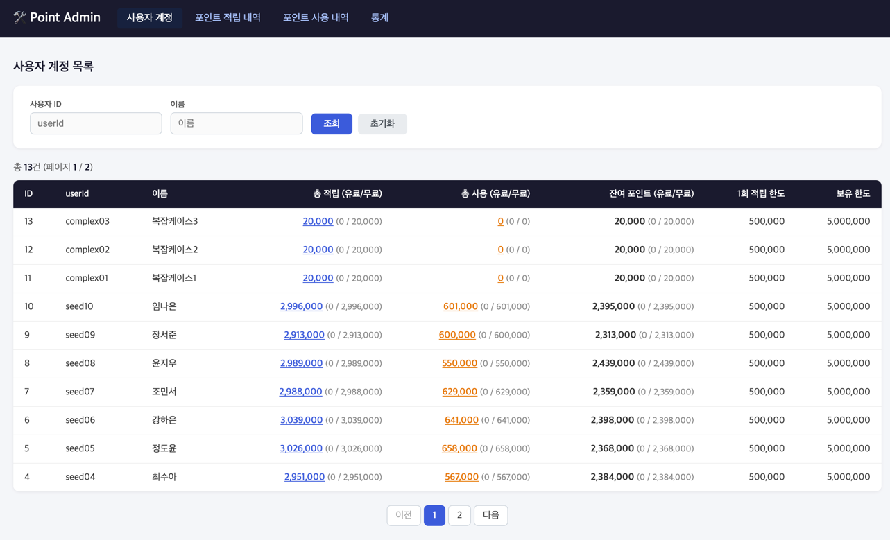
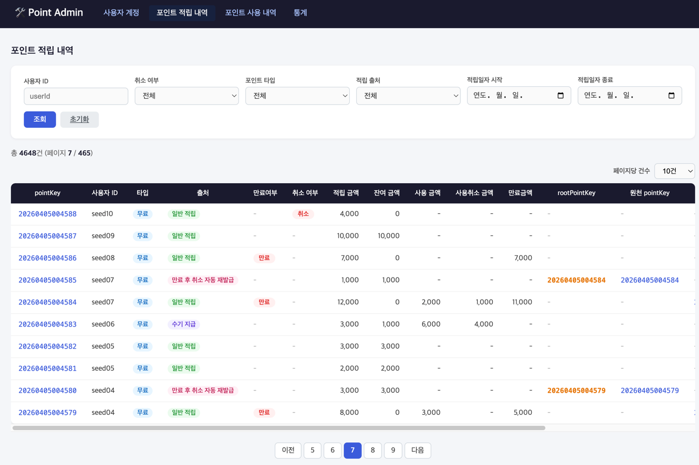
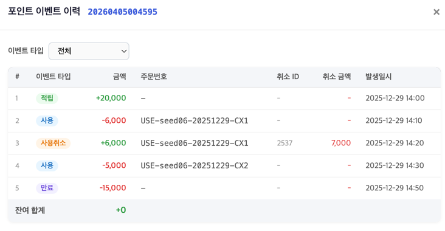
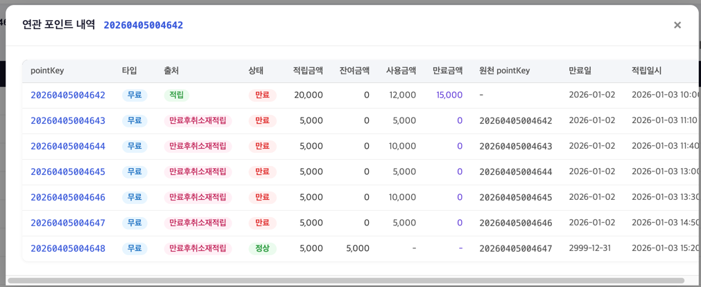
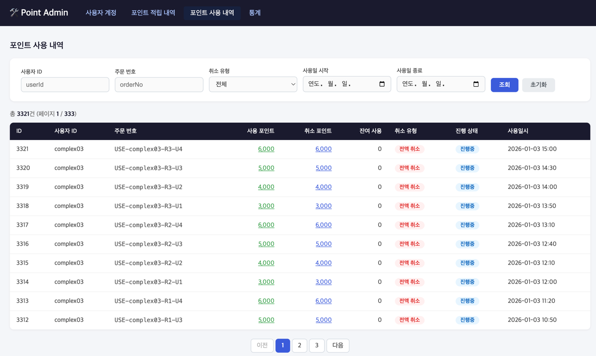
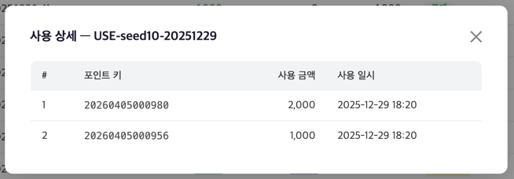
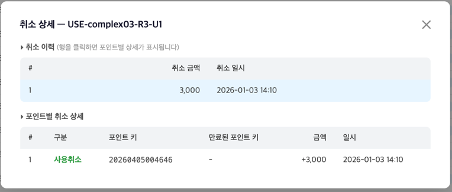
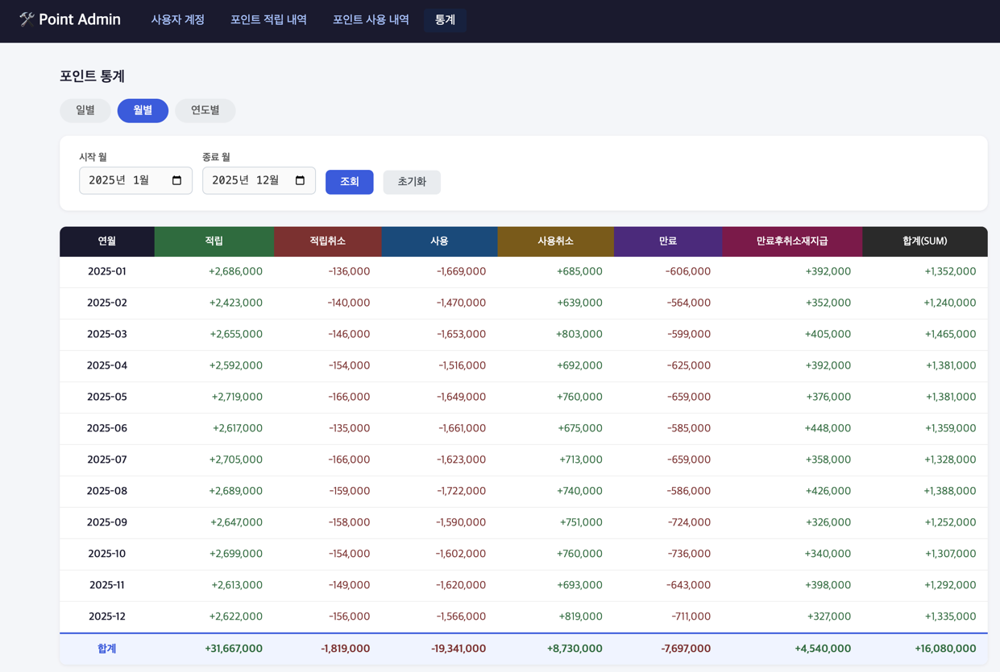

# Admin 화면 설명

## 개요

포인트 Admin은 운영자가 사용자 포인트 현황을 조회·분석할 수 있는 내부 관리 도구입니다.  
Spring Boot + Thymeleaf 기반의 서버사이드 렌더링 웹 UI로 제공되며, 별도 인증 없이 `/admin` 경로로 접근합니다.

---

## 공통 레이아웃

모든 Admin 페이지는 상단에 동일한 헤더와 네비게이션 바를 공유합니다.

네비게이션 메뉴

| 메뉴 | URL | 설명 |
|------|-----|------|
| 사용자 계정 | `/admin/accounts` | 사용자별 포인트 잔액 현황 |
| 포인트 적립 내역 | `/admin/points` | 포인트 단건 적립/취소/만료 내역 |
| 포인트 사용 내역 | `/admin/orders` | 주문 기반 포인트 사용/취소 내역 |
| 통계 | `/admin/stats` | 일별/월별/연도별 집계 통계 |

---

## 1. 사용자 계정 (`/admin/accounts`)

사용자별 포인트 보유 현황을 한눈에 확인할 수 있는 페이지입니다.  
사용자 ID 또는 이름으로 검색할 수 있으며, 각 사용자의 누적 적립·사용·잔여 포인트를 유료/무료로 구분하여 표시합니다.

검색 조건 및 테이블 컬럼

### 검색 조건

| 필드 | 설명 |
|------|------|
| 사용자 ID | userId 부분 일치 검색 |
| 이름 | 이름 부분 일치 검색 |

### 테이블 컬럼

| 컬럼 | 설명 |
|------|------|
| ID | DB 내부 ID |
| userId | 사용자 식별자 |
| 이름 | 사용자 이름 |
| 총 적립 (유료/무료) | 누적 적립 포인트 합계. 클릭 시 해당 사용자의 포인트 적립 내역 페이지로 이동 |
| 총 사용 (유료/무료) | 누적 사용 포인트 합계. 클릭 시 해당 사용자의 포인트 사용 내역 페이지로 이동 |
| 잔여 포인트 (유료/무료) | 현재 보유 포인트 |
| 1회 적립 한도 | 1회 최대 적립 가능 금액 |
| 보유 한도 | 최대 보유 가능 포인트 |

---

## 2. 포인트 적립 내역 (`/admin/points`)

포인트 단건별 적립·취소·만료 이력을 조회하는 페이지입니다.  
각 포인트 건의 상태(취소 여부, 만료 여부), 타입(유료/무료), 출처(적립/수기지급/만료후취소재적립)를 필터링하여 조회할 수 있습니다.

검색 조건 및 테이블 컬럼

### 검색 조건

| 필드 | 설명 |
|------|------|
| 사용자 ID | 특정 사용자의 포인트만 조회 |
| 취소 여부 | 전체 / 취소된 건만 필터링 |
| 포인트 타입 | 전체 / 무료(FREE) / 유료(PAID) |
| 적립 출처 | 전체 / 적립(ACCUMULATION) / 수기지급(MANUAL) / 만료후취소재적립(AUTO_RESTORED) |
| 적립일자 | 시작일 ~ 종료일 범위 지정 |

### 테이블 컬럼

| 컬럼 | 설명 |
|------|------|
| pointKey | 포인트 고유 키. 클릭 시 해당 포인트의 이벤트 이력 모달 팝업 |
| 사용자 ID | 포인트 소유자 |
| 타입 | 무료(파란색 뱃지) / 유료(노란색 뱃지) |
| 출처 | 적립(초록) / 수기지급(보라) / 만료후취소재적립(분홍) |
| 만료 여부 | 만료된 경우 빨간 뱃지 표시 |
| 취소 여부 | 취소된 경우 빨간 뱃지 표시 |
| 적립 금액 | 최초 적립된 금액 |
| 잔여 금액 | 현재 남은 금액 |
| 사용 금액 | 사용된 금액 합계 |
| 사용취소 금액 | 사용 취소된 금액 합계 |
| 만료 금액 | 만료된 금액 |
| rootPointKey | 재발급 체인의 최상위 포인트 키. 클릭 시 연관 포인트 내역 모달 팝업 |
| 원천 pointKey | 만료 후 재지급된 경우 원천 포인트 키 |
| 재지급 pointKey | 이 포인트에서 재지급된 포인트 키 |
| 만료일 | 포인트 만료 예정일 |
| 적립일시 | 포인트 적립 일시 |

### 모달 — 포인트 이벤트 이력

`pointKey`를 클릭하면 해당 포인트에 발생한 모든 이벤트를 시계열 순으로 확인할 수 있는 모달이 열립니다.  
각 이벤트는 타입에 따라 색상으로 구분되며, 금액의 증감(+/-)도 함께 표시됩니다.

이벤트 타입 색상 코드

| 이벤트 타입 | 한글명 | 금액 부호 | 색상 |
|------------|--------|----------|------|
| ACCUMULATE | 적립 | + | 초록 |
| USE | 사용 | - | 파랑 |
| ACCUMULATE_CANCEL | 적립취소 | - | 빨강 |
| USE_CANCEL | 사용취소 | + | 주황 |
| EXPIRE | 만료 | - | 보라 |
| EXPIRED_CANCEL_RESTORE | 만료후취소재적립 | + | 분홍 |

### 모달 — 연관 포인트 내역

`rootPointKey`를 클릭하면 동일 재발급 체인에 속한 모든 포인트(원천 포인트 + 재지급 포인트)를 한 화면에서 확인할 수 있습니다.  
만료 후 재지급이 반복된 경우, 포인트 간의 연결 관계를 추적하는 데 유용합니다.

---

## 3. 포인트 사용 내역 (`/admin/orders`)

주문 단위의 포인트 사용 및 취소 이력을 조회하는 페이지입니다.  
사용자 ID, 주문번호, 주문 타입(사용/취소), 날짜 범위로 필터링할 수 있습니다.

검색 조건 및 테이블 컬럼

### 검색 조건

| 필드 | 설명 |
|------|------|
| 사용자 ID | 특정 사용자의 주문만 조회 |
| 주문번호 | 외부 주문 식별자로 검색 |
| 주문 타입 | 전체 / USE(사용) / USE_CANCEL(취소) |
| 시작일 ~ 종료일 | 주문 날짜 범위 지정 |

### 테이블 컬럼

| 컬럼 | 설명 |
|------|------|
| 주문 ID | DB 내부 ID |
| 사용자 ID | 포인트 사용자 |
| 주문번호 | 외부 주문 식별자 |
| 타입 | USE(사용) / USE_CANCEL(취소) |
| 사용 금액 | 해당 주문에서 사용된 포인트 총액. 클릭 시 포인트별 사용 상세 모달 팝업 |
| 취소 금액 | 취소된 포인트 총액. 클릭 시 취소 이력 모달 팝업 |
| 주문일시 | 주문 생성 일시 |
| 취소일시 | 취소 처리 일시 |

### 모달 — 포인트별 사용/취소 상세

사용 금액 또는 취소 금액 셀을 클릭하면 해당 주문에서 포인트가 어떻게 차감·복원되었는지 건별 상세 내역을 모달로 확인할 수 있습니다.

---

## 4. 통계 (`/admin/stats`)

일별·월별·연도별 포인트 집계 통계를 조회하는 페이지입니다.  
탭을 전환하여 원하는 집계 단위를 선택하고, 날짜 범위를 지정하면 해당 기간의 적립·사용·취소·만료 금액 합계를 확인할 수 있습니다.

검색 조건 및 집계 컬럼

### 집계 단위별 검색 조건

| 단위 | 검색 필드 |
|------|----------|
| 일별 | 시작일 ~ 종료일 |
| 월별 | 시작 월 ~ 종료 월 |
| 연도별 | 시작 연도 ~ 종료 연도 |

### 집계 컬럼

| 컬럼 | 헤더 색상 | 의미 |
|------|----------|------|
| 적립 | 초록 | 신규 포인트 적립 합계 |
| 적립취소 | 빨강 | 적립 취소 합계 |
| 사용 | 파랑 | 포인트 사용 합계 |
| 사용취소 | 주황 | 사용 취소 합계 |
| 만료 | 보라 | 포인트 만료 합계 |
| 만료후취소재지급 | 분홍 | 만료 후 취소 시 재지급 합계 |
| 합계(SUM) | 어두운 배경 | 적립 - 적립취소 - 사용 + 사용취소 - 만료 + 만료후취소재지급 |

