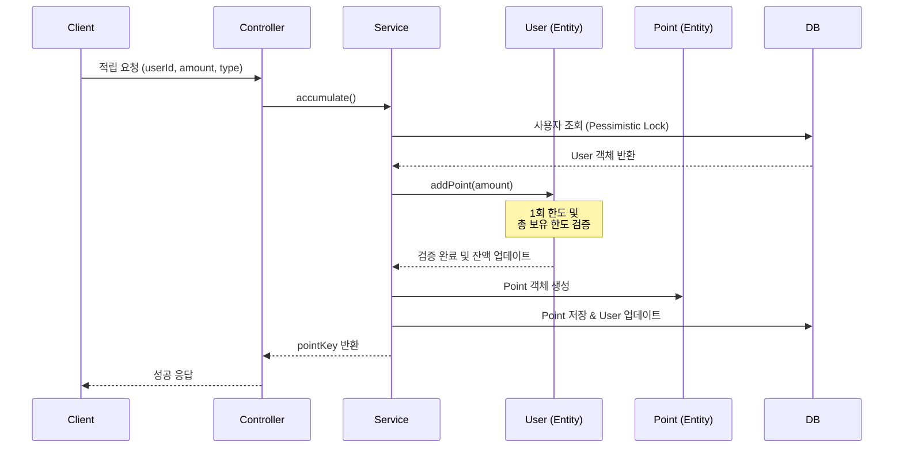

# 포인트 적립 API

사용자에게 포인트를 적립합니다.

## API 명세

- **Method**: `POST`
- **Path**: `/api/points/accumulate`
- **Description**: 사용자에게 포인트를 적립하며, 1회 최대 적립 한도 및 총 보유 한도를 검증합니다.

### 요청 (Request Body)

| 필드명 | 타입 | 필수 여부 | 설명 | 예시 |
| :--- | :--- | :--- | :--- | :--- |
| `userId` | String | O | 사용자 식별 ID | `user1` |
| `amount` | Long | O | 적립 금액 (1P 이상) | `1000` |
| `isManual` | Boolean | X | 관리자 수기 지급 여부 (기본: `false`) | `false` |
| `type` | String | O | 포인트 타입 (`FREE`, `PAID`) | `FREE` |
| `expiryDays` | Integer | X | 만료일 수 (미입력 시 2999-12-31) | `365` |

### 응답 (Response Body)

```json
{
  "code": "SUCCESS",
  "message": "적립 성공",
  "data": "20260331000001" 
}
```
- `data`: 생성된 포인트 적립 건의 고유 식별 키 (`pointKey`)

---

## 데이터 흐름 및 상태 변화

### 1. 처리 흐름 (Sequence Diagram)



### 2. 데이터베이스 상태 변화 예시

**사용자(USER) 테이블**
- `user1`의 현재 `totalPoint`: 5,000P
- `user1`의 `maxRetentionPoint`: 1,000,000P
- `user1`의 `maxAccumulationPoint`: 100,000P

**[Step 1] 1,000P 적립 요청 발생**

| 테이블 | 필드 | 변경 전 | 변경 후 | 비고 |
| :--- | :--- | :--- | :--- | :--- |
| **USER** | `totalPoint` | `5,000` | `6,000` | 잔액 1,000P 증가 |
| **POINT** | (신규 레코드) | - | `id: 10, amount: 1000, ...` | 새로운 적립 내역 생성 |

**[결과 데이터]**

**POINT 테이블 (신규 추가된 데이터)**
| id | userId | pointKey | amount | remainingAmount | type | isManual | expiryDate |
| :--- | :--- | :--- | :--- | :--- | :--- | :--- | :--- |
| 10 | user1 | 20260331000001 | 1000 | 1000 | FREE | false | 2027-03-31 |

---

## 주요 비즈니스 규칙

1. **최소 금액**: 1회 적립 시 최소 1포인트 이상이어야 합니다.
2. **1회 최대 한도**: `User` 엔티티에 설정된 `maxAccumulationPoint`를 초과하여 적립할 수 없습니다.
3. **총 보유 한도**: 적립 후 사용자의 `totalPoint`가 `maxRetentionPoint`를 초과할 경우 적립이 거부됩니다.
4. **동시성 제어**: 적립 처리 시 `User` 레코드에 비관적 락(`PESSIMISTIC_WRITE`)을 걸어 안전하게 잔액을 업데이트합니다.
