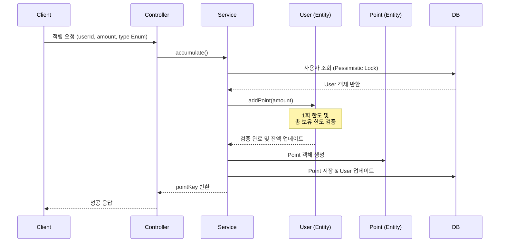

# 포인트 적립 API

사용자에게 포인트를 적립합니다.

## API 명세

- **Method**: `POST`
- **Path**: `/api/points/accumulate`
- **Description**: 사용자에게 포인트를 적립하며, 1회 최대 적립 한도 및 총 보유 한도를 검증합니다.

### 요청 (Request Body)

| 필드명 | 타입 | 필수 여부 | 설명 | 예시 |
| :--- | :--- | :--- | :--- | :--- |
| `userId` | String | O | 사용자 식별 ID | `user1` |
| `amount` | Long | O | 적립 금액 (1P 이상) | `1000` |
| `isManual` | Boolean | X | 관리자 수기 지급 여부 (기본: `false`) | `false` |
| `type` | Enum | O | 포인트 타입 (`FREE`, `PAID`) | `FREE` |
| `expiryDays` | Integer | X | 만료일 수 (미입력 시 2999-12-31) | `365` |

### 응답 (Response Body)

```json
{
  "code": "SUCCESS",
  "message": "적립 성공",
  "data": "20260331000001" 
}
```
- `data`: 생성된 포인트 적립 건의 고유 식별 키 (`pointKey`)

---

## 데이터 흐름 및 상태 변화

### 1. 처리 흐름 (Sequence Diagram)



### 2. 케이스별 데이터 변화 예시

#### [Case 1] 정상적인 포인트 적립 (성공)
1,000P를 성공적으로 적립하는 경우입니다.

**기본 상태**
- `user1`의 현재 `totalPoint`: **5,000P**
- `user1`의 한도: `maxRetentionPoint: 100,000`, `maxAccumulationPoint: 10,000`

| 테이블 | 필드 | 변경 전 | 변경 후 | 비고 |
| :--- | :--- | :--- | :--- | :--- |
| **USER** | `totalPoint` | `5,000` | `6,000` | 전체 잔액 1,000P 증가 |
| **POINT** | (신규 추가) | - | `amount: 1000` | 새로운 적립 레코드 생성 |

---

#### [Case 2] 1회 적립 한도 초과 (실패)
사용자의 1회 최대 적립 한도(10,000P)를 초과하여 20,000P 적립을 시도하는 경우입니다.

| 테이블 | 필드 | 상태 | 결과 | 비고 |
| :--- | :--- | :--- | :--- | :--- |
| **USER** | `totalPoint` | `5,000` | **변화 없음** | 예외 발생 (400 Bad Request) |
| **POINT** | (신규 추가) | - | **생성 안 됨** | 검증 실패 |

---

#### [Case 3] 총 보유 한도 초과 (실패)
적립 후의 총 잔액이 보유 한도(100,000P)를 넘어서는 경우입니다. (현재 잔액 95,000P인 상태에서 10,000P 적립 시도)

| 테이블 | 필드 | 상태 | 결과 | 비고 |
| :--- | :--- | :--- | :--- | :--- |
| **USER** | `totalPoint` | `95,000` | **변화 없음** | 예외 발생 (400 Bad Request) |
| **POINT** | (신규 추가) | - | **생성 안 됨** | 보유 한도 초과 |

---

## 주요 비즈니스 규칙

1. **최소 금액**: 1회 적립 시 최소 1포인트 이상이어야 합니다.
2. **1회 최대 한도**: `User` 엔티티에 설정된 `maxAccumulationPoint`를 초과하여 적립할 수 없습니다.
3. **총 보유 한도**: 적립 후 사용자의 `totalPoint`가 `maxRetentionPoint`를 초과할 경우 적립이 거부됩니다.
4. **동시성 제어**: 적립 처리 시 `User` 레코드에 비관적 락(`PESSIMISTIC_WRITE`)을 걸어 안전하게 잔액을 업데이트합니다.
