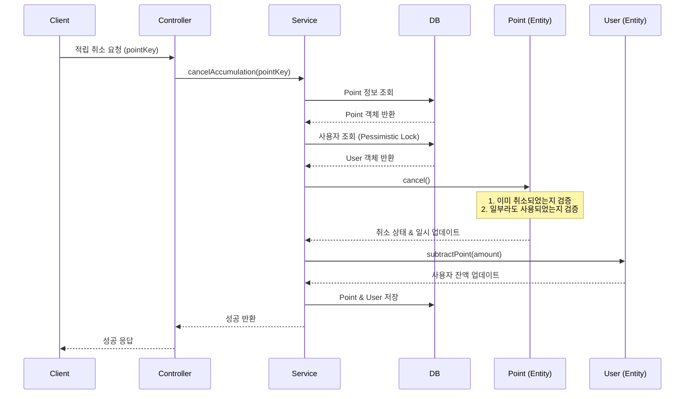

# 적립 취소 API

특정 적립 건을 취소합니다.

## API 명세

- **Method**: `POST`
- **Path**: `/api/points/accumulate/{pointKey}/cancel`
- **Description**: 적립된 포인트 전액을 취소합니다. 이미 사용된 포인트가 있는 경우 취소할 수 없습니다.

### 경로 변수 (Path Variable)

| 변수명 | 타입 | 설명 |
| :--- | :--- | :--- |
| `pointKey` | String | 취소할 적립 건의 고유 식별 키 |

### 응답 (Response Body)

```json
{
  "code": "SUCCESS",
  "message": "적립 취소 성공",
  "data": null
}
```

---

## 데이터 흐름 및 상태 변화

### 1. 처리 흐름 (Sequence Diagram)



### 2. 데이터베이스 상태 변화 예시

**POINT 테이블 (ID 10)**
- `pointKey`: 20260331000001
- `amount`: 1,000P
- `remainingAmount`: 1,000P
- `isCancelled`: `false`

**USER 테이블**
- `userId`: `user1`
- `totalPoint`: 6,000P

**[Step 1] 적립 취소 요청 발생**

| 테이블 | 필드 | 변경 전 | 변경 후 | 비고 |
| :--- | :--- | :--- | :--- | :--- |
| **POINT** | `isCancelled` | `false` | `true` | 취소 상태로 변경 |
| **POINT** | `cancelledDate` | `null` | `2026-03-31T11:27` | 취소 일시 기록 |
| **USER** | `totalPoint` | `6,000` | `5,000` | 취소된 만큼 사용자 잔액 차감 |

---

## 주요 비즈니스 규칙

1. **사용 여부 확인**: 적립된 금액 중 일부라도 사용된 경우( `remainingAmount < amount` ) 적립 취소가 불가능합니다.
2. **중복 취소 방지**: 이미 취소된 건은 다시 취소할 수 없습니다.
3. **사용자 잔액 반영**: 취소가 성공하면 사용자의 `totalPoint`에서도 해당 금액만큼 즉시 차감됩니다.
4. **동시성 제어**: 사용자 잔액 업데이트 시 비관적 락을 획득하여 데이터 정합성을 보장합니다.
