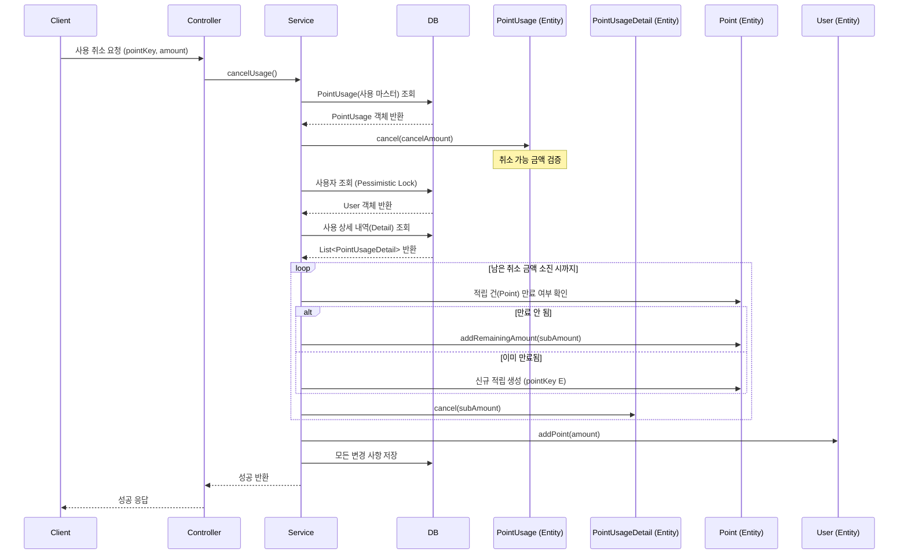

# 사용 취소 API

사용한 포인트를 취소(복구)합니다.

## API 명세

- **Method**: `POST`
- **Path**: `/api/points/use/{pointKey}/cancel`
- **Description**: 사용된 포인트의 전액 또는 일부를 취소합니다. 이미 만료된 포인트는 원본 적립 건으로 복구하지 않고 신규 적립 처리됩니다.

### 경로 변수 (Path Variable)

| 변수명 | 타입 | 설명 |
| :--- | :--- | :--- |
| `pointKey` | String | 사용 시 발급된 고유 식별 키 |

### 요청 (Request Body)

| 필드명 | 타입 | 필수 여부 | 설명 | 예시 |
| :--- | :--- | :--- | :--- | :--- |
| `amount` | Long | O | 취소 금액 (부분 취소 가능) | `500` |

### 응답 (Response Body)

```json
{
  "code": "SUCCESS",
  "message": "사용 취소 성공",
  "data": null
}
```

---

## 데이터 흐름 및 상태 변화

### 1. 처리 흐름 (Sequence Diagram)



### 2. 데이터베이스 상태 변화 예시

**[상태]**
- 사용자 `user1`의 잔액: 300P
- 사용 건 `pointKey`: `20260331000002` (총 1,200P 사용)
- 상세 A: 700P 사용 (만료됨)
- 상세 B: 500P 사용 (만료 안 됨)

**[Step 1] 1,100P 사용 취소 요청 발생**

| 테이블 | 필드 | 변경 전 | 변경 후 | 비고 |
| :--- | :--- | :--- | :--- | :--- |
| **USER** | `totalPoint` | `300` | `1,400` | 사용자 잔액 1,100P 복구 |
| **POINT (B)** | `remainingAmount` | `0` | `400` | B에서 사용한 500P 중 400P 복구 (미만료) |
| **POINT (E)** | (신규 추가) | - | `amount: 700` | A에서 사용한 700P는 만료되어 신규 적립 (pointKey E) |
| **POINT_USAGE** | `cancelledAmount`| `0` | `1,100` | 사용 마스터에 취소 금액 누적 |

---

## 주요 비즈니스 규칙

1. **만료 처리**: 사용 취소 시점에 이미 만료된 포인트는 원본 적립 건으로 복구할 수 없습니다. 대신, 해당 금액만큼 유효기간이 2999-12-31인 **신규 포인트로 적립** 처리됩니다.
2. **부분 취소**: 전체 금액이 아닌 일부 금액만 취소할 수 있으며, 여러 번에 나누어 취소도 가능합니다.
3. **금액 검증**: 취소하려는 총 금액은 원본 사용 금액을 초과할 수 없습니다.
4. **추적성 유지**: 어느 적립 건(Point)이 복구되었는지 혹은 신규 적립되었는지를 상세 내역(`PointUsageDetail`)을 통해 1원 단위까지 관리합니다.
5. **동시성 제어**: 사용자 잔액 업데이트 시 비관적 락을 획득하여 데이터 정합성을 유지합니다.
