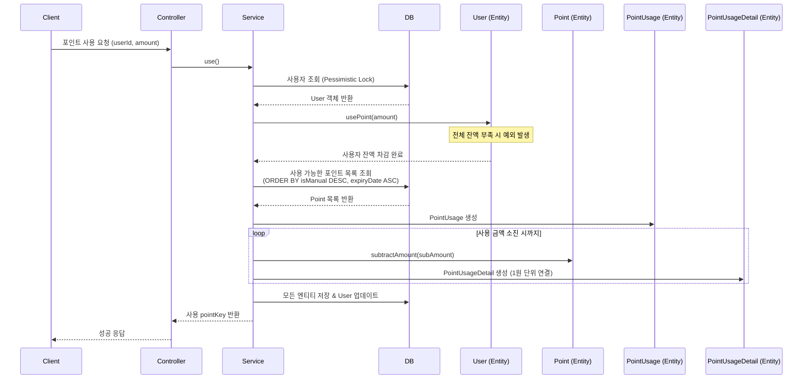

# 포인트 사용 API

주문 시 포인트를 사용하여 결제합니다.

## API 명세

- **Method**: `POST`
- **Path**: `/api/points/use`
- **Description**: 주문에 필요한 포인트를 차감하며, 관리자 수기 포인트 및 만료 임박 포인트가 우선적으로 사용됩니다.

### 요청 (Request Body)

| 필드명 | 타입 | 필수 여부 | 설명 | 예시 |
| :--- | :--- | :--- | :--- | :--- |
| `userId` | String | O | 사용자 식별 ID | `user1` |
| `orderNo` | String | O | 주문 번호 | `A1234` |
| `amount` | Long | O | 사용 금액 | `500` |

### 응답 (Response Body)

```json
{
  "code": "SUCCESS",
  "message": "사용 성공",
  "data": "20260331000002"
}
```
- `data`: 생성된 포인트 사용 건의 고유 식별 키 (`pointKey`)

---

## 데이터 흐름 및 상태 변화

### 1. 처리 흐름 (Sequence Diagram)



## 케이스별 데이터 변화 예시

### [Case 1] 정상적인 포인트 사용 (성공)
관리자 수기 포인트(B) 500P를 먼저 쓰고, 나머지 700P를 일반 포인트(A)에서 차감하는 시나리오입니다.

**기본 상태**
- `user1`의 잔액: **1,500P**
- 적립 내역 A: 1,000P (일반, 만료: 2026-12-31)
- 적립 내역 B: 500P (수기, 만료: 2027-12-31)

| 테이블 | 필드 | 변경 전 | 변경 후 | 비고 |
| :--- | :--- | :--- | :--- | :--- |
| **USER** | `totalPoint` | `1,500` | `300` | 전체 잔액 차감 |
| **POINT (B)** | `remainingAmount` | `500` | `0` | **1순위**: 수기 포인트 소진 (500P) |
| **POINT (A)** | `remainingAmount` | `1,000` | `300` | **2순위**: 일반 포인트 차감 (700P) |
| **POINT_USAGE** | (신규) | - | `amount: 1200` | 사용 마스터 레코드 생성 |
| **POINT_USAGE_DETAIL** | (신규 2건) | - | `B: 500, A: 700` | 상세 매칭 내역 저장 (추적용) |

---

### [Case 2] 잔액 부족 (실패)
현재 잔액(1,500P)보다 많은 2,000P 사용을 요청한 경우입니다.

| 테이블 | 필드 | 상태 | 결과 | 비고 |
| :--- | :--- | :--- | :--- | :--- |
| **USER** | `totalPoint` | `1,500` | **변화 없음** | 예외 발생 (409 Conflict) |
| **POINT** | `remainingAmount` | `1,000 / 500` | **변화 없음** | 로직 중단 |

---

### [Case 3] 사용 가능한 포인트 없음 (실패)
모든 포인트가 만료되었거나 취소된 상태에서 사용을 시도하는 경우입니다.

| 결과 | 비고 |
| :--- | :--- |
| **예외 발생** | 사용 가능한 잔액이 부족합니다. (409 Conflict) |

---

## 주요 비즈니스 규칙

1. **사용 우선순위**: 
    - 1순위: 관리자 수기 지급 포인트 (`isManual = true`)
    - 2순위: 만료일이 짧게 남은 순서 (`expiryDate ASC`)
2. **잔액 검증**: 사용자의 `totalPoint`가 요청 금액보다 적으면 즉시 실패 처리합니다.
3. **추적성**: 포인트가 사용될 때마다 어떤 적립 건에서 얼마가 차감되었는지를 `PointUsageDetail`에 1원 단위까지 기록합니다.
4. **동시성 제어**: 사용자 레코드에 비관적 락을 획득하여 동시 사용 요청 시 중복 차감을 방지합니다.
