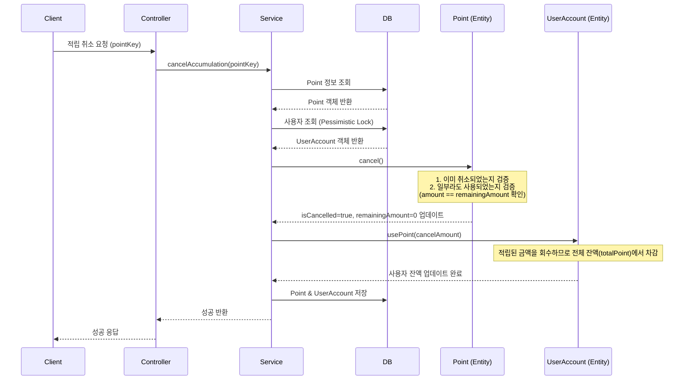

# 적립 취소 API

특정 적립 건을 취소합니다.

## API 명세

- **Method**: `POST`
- **Path**: `/points/accumulate/{pointKey}/cancel`
- **Description**: 적립된 포인트 전액을 취소합니다. 이미 사용된 포인트가 있는 경우 취소할 수 없습니다.

### 경로 변수 (Path Variable)

| 변수명 | 타입 | 설명 |
| :--- | :--- | :--- |
| `pointKey` | String | 취소할 적립 건의 고유 식별 키 |

### 응답 (Response Body)

#### [성공]
```json
{
  "code": "SUCCESS",
  "message": "적립 취소 성공",
  "data": null
}
```

#### [실패]
- **이미 사용됨 (409 Conflict)**
```json
{
  "code": "CONFLICT",
  "message": "이미 사용된 포인트가 있어 취소할 수 없습니다.",
  "data": null
}
```
- **찾을 수 없음 (404 Not Found)**
```json
{
  "code": "NOT_FOUND",
  "message": "해당 적립 건을 찾을 수 없습니다.",
  "data": null
}
```

---

## 데이터 흐름 및 상태 변화

### 1. 처리 흐름 (Sequence Diagram)



---

## 케이스별 데이터 변화 예시

### [Case 1] 정상적인 적립 취소 (성공)
이미 적립된 1,000P를 사용하기 전에 취소하는 경우입니다.

**기본 상태**
- `user1`의 잔액: **6,000P**
- 적립 내역 (pointKey: A): `amount: 1,000`, `remainingAmount: 1,000`, `isCancelled: false`

| 테이블 | 필드 | 변경 전 | 변경 후 | 비고 |
| :--- | :--- | :--- | :--- | :--- |
| **POINT** | `isCancelled` | `false` | `true` | 취소 완료 |
| **POINT** | `remainingAmount` | `1,000` | `0` | 해당 적립 건의 사용 가능 잔액 0으로 변경 |
| **USER_ACCOUNT** | `totalPoint` | `6,000` | `5,000` | **전체 잔액에서 1,000P 차감** (적립 철회) |

> **💡 왜 차감되나요?**
> 적립은 사용자에게 포인트를 '지급'한 행위입니다. 그 행위를 '취소'하는 것이므로, 사용자가 보유하고 있던 전체 포인트 잔액에서 다시 그만큼을 회수(차감)하는 것이 논리적으로 맞습니다.

---

### [Case 2] 이미 일부가 사용된 경우 (실패)
적립된 1,000P 중 200P를 이미 사용한 상태에서 취소를 시도하는 경우입니다.

**기본 상태**
- `user1`의 잔액: **5,800P**
- 적립 내역 (pointKey: A): `amount: 1,000`, `remainingAmount: 800`, `isCancelled: false`

| 테이블 | 필드 | 상태 | 결과 | 비고 |
| :--- | :--- | :--- | :--- | :--- |
| **POINT** | `remainingAmount` | `800` | **취소 불가** | `amount(1,000)`와 불일치 |
| **USER_ACCOUNT** | `totalPoint` | `5,800` | **변화 없음** | 예외 발생 (409 Conflict) |

---

### [Case 3] 이미 취소된 건을 다시 취소 (실패)

**기본 상태**
- 적립 내역 (pointKey: A): `isCancelled: true`

| 테이블 | 필드 | 상태 | 결과 | 비고 |
| :--- | :--- | :--- | :--- | :--- |
| **POINT** | `isCancelled` | `true` | **취소 불가** | 이미 취소된 상태 |

---

## 주요 비즈니스 규칙

1. **사용 여부 확인**: 적립된 금액 중 일부라도 사용된 경우( `remainingAmount < amount` ) 적립 취소가 불가능합니다.
2. **전체 잔액 반영**: 취소 시 사용자의 `totalPoint`에서 취소되는 적립 건의 잔액만큼 차감합니다. (사용자가 적립받은 혜택을 회수하는 개념)
3. **동시성 제어**: 사용자 레코드에 비관적 락을 획득하여 취소 도중 다른 사용 요청이 들어오지 못하도록 보호합니다.
