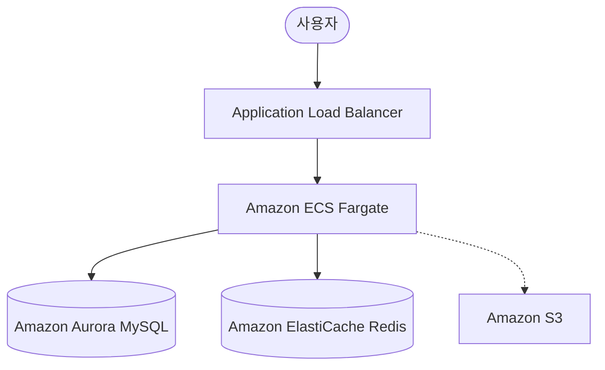

# AWS 아키텍처 구성

본 프로젝트를 AWS 기반으로 서비스한다고 가정했을 때의 아키텍처 구성을 설명합니다.

## 아키텍처 다이어그램 (Mermaid)

## 구성 요소 상세

1. **Compute: Amazon ECS (Fargate)**
    - 서버리스 컨테이너 서비스를 사용하여 인프라 관리 부담을 줄이고 탄력적인 오토스케일링을 지원합니다.
    - 트래픽 변화에 따라 포인트 처리 엔진을 동적으로 확장합니다.

2. **Database: Amazon Aurora MySQL (Multi-AZ)**
    - 고가용성을 위해 다중 가용 영역(Multi-AZ)에 배포합니다.
    - 포인트 데이터의 정합성을 보장하며, 읽기 복제본(Read Replica)을 통해 조회 성능을 최적화합니다.

3. **Cache: Amazon ElastiCache (Redis)**
    - 빈번하게 조회되는 사용자의 현재 총 포인트(`totalPoint`) 정보를 캐싱하여 응답 속도를 향상시킵니다.
    - Write-Around 또는 Write-Through 전략을 사용하여 DB와 캐시 간의 일관성을 유지합니다.

4. **Network: Application Load Balancer (ALB)**
    - 외부 요청을 수신하여 여러 ECS 태스크로 트래픽을 분산합니다.
    - SSL/TLS 인증서 관리를 통해 보안 통신을 제공합니다.

5. **Monitoring & Logs: CloudWatch & X-Ray**
    - 시스템의 메트릭 수집 및 장애 대응을 위해 CloudWatch를 사용합니다.
    - 포인트 트랜잭션의 추적 및 성능 병목 분석을 위해 AWS X-Ray를 활용할 수 있습니다.
