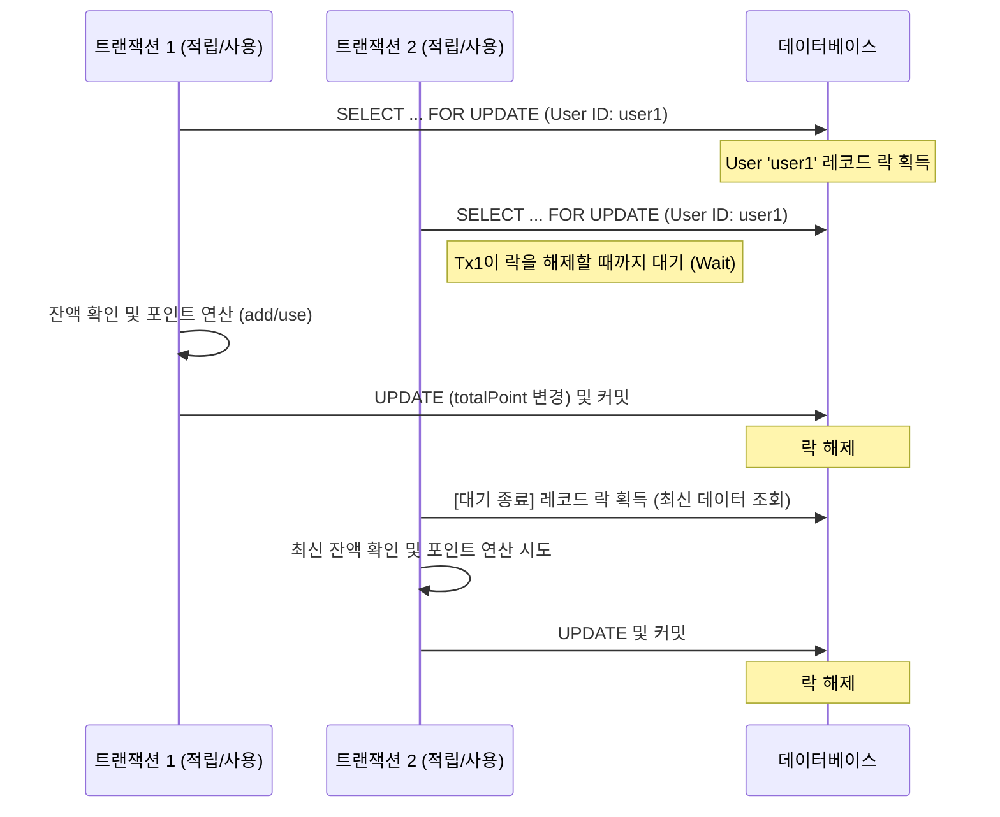

# [무신사페이먼츠] 비관적 락(Pessimistic Lock)을 이용한 포인트 동시성 제어

### 🏢 도메인 / 시스템
- **도메인**: 포인트 시스템 (무료 포인트)
- **핵심 엔티티**: `User` (사용자 잔액 및 한도 관리)

### ❓ 문제 상황 (Challenge)
- **동시성 이슈**: 한 사용자가 거의 동시에 여러 건의 포인트 적립 또는 사용 요청을 보낼 경우, 데이터 정합성이 깨질 위험이 있음.
- **Race Condition**: 두 트랜잭션이 동시에 사용자의 현재 잔액(`totalPoint`)을 읽고 수정할 때, 나중에 커밋된 데이터가 먼저 커밋된 데이터를 덮어쓰는 **Lost Update** 현상이 발생함.
- **결과**: 사용자의 포인트 잔액이 부정확하게 계산되거나, 개인별 보유 한도를 초과하여 적립되는 등의 치명적인 오류가 발생할 수 있음.

### 🛠 해결 방안 (Action)
- **비관적 락(Pessimistic Lock) 도입**: DB 수준에서 `SELECT ... FOR UPDATE`를 사용하여 특정 사용자 레코드에 대한 점유권을 명시적으로 획득하는 비관적 락을 적용.
- **비관적 락 채택 이유**:
    - **정합성 최우선**: 포인트는 현금과 유사한 가치를 지니므로, 동시성 제어 실패로 인한 데이터 오류 비용이 매우 큼.
    - **단순하고 확실한 보호**: 애플리케이션 계층에서 복잡한 재시도 로직을 구현하는 것보다 DB 수준의 확실한 데이터 보호를 선택.
    - **사용자별 독립성**: 락의 범위가 특정 사용자(`User ID`)로 한정되므로, 전체 시스템 성능에 미치는 영향이 제한적임.
- **Spring Data JPA @Lock 활용**: Repository 계층에서 `LockModeType.PESSIMISTIC_WRITE`를 설정하여 데이터 조회 시점에 배타적 락을 획득하도록 구현.

#### 📊 비관적 락 동작 흐름

### 💻 구현 코드 (Java / Spring Data JPA)

실제 프로젝트에서 비관적 락을 구현한 코드는 아래 링크에서 확인할 수 있습니다.

#### 1. Entity ([User.java](../src/main/java/org/musinsa/payments/point/domain/User.java))
- `addPoint`, `usePoint` 메서드를 통해 잔액 변경 및 한도 체크 로직이 캡슐화되어 있습니다.
- [GitHub 소스 보기](https://github.com/muzzaiwork/point/blob/main/src/main/java/org/musinsa/payments/point/domain/User.java)

#### 2. Repository ([UserRepository.java](../src/main/java/org/musinsa/payments/point/repository/UserRepository.java))
- `@Lock(LockModeType.PESSIMISTIC_WRITE)` 어노테이션을 사용하여 `SELECT ... FOR UPDATE` 쿼리를 실행합니다.
- [GitHub 소스 보기](https://github.com/muzzaiwork/point/blob/main/src/main/java/org/musinsa/payments/point/repository/UserRepository.java)

#### 3. Service ([PointService.java](../src/main/java/org/musinsa/payments/point/service/PointService.java))
- `accumulate`, `use`, `cancelUsage` 등 주요 비즈니스 메서드 시작 시점에 `findByUserIdWithLock`을 호출하여 락을 획득합니다.
- [GitHub 소스 보기](https://github.com/muzzaiwork/point/blob/main/src/main/java/org/musinsa/payments/point/service/PointService.java)

### ✨ 성과 및 결과 (Result)
- **완벽한 데이터 정합성**: 동시 요청 시에도 사용자별 잔액 및 한도 검증이 정확하게 이루어짐.
- **안정적인 운영**: 비관적 락을 통해 Race Condition을 근본적으로 차단하여 시스템 신뢰도 향상.
