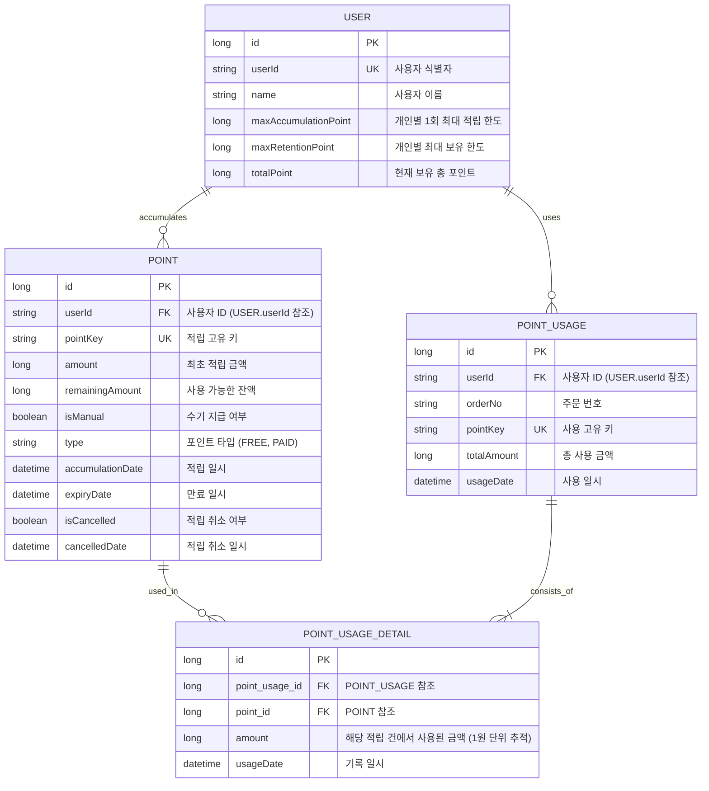

# 포인트 시스템 ERD

본 프로젝트의 데이터베이스 설계를 Mermaid 다이어그램으로 나타냅니다.

### 테이블 설명

1. **USER (사용자)**
    - 개인별 1회 최대 적립 한도(`maxAccumulationPoint`), 최대 보유 한도(`maxRetentionPoint`)와 현재 잔액(`totalPoint`)을 관리합니다.
    - **비관적 락**을 통해 동시성 제어가 필요한 핵심 레코드입니다. (상세 내용: [concurrency.md](concurrency.md))

2. **POINT (적립 내역)**
    - 사용자가 적립한 포인트 정보를 저장합니다.
    - `remainingAmount`를 통해 현재 사용 가능한 잔액을 관리합니다.
    - `isManual` 필드로 관리자 수기 지급 여부를 구분합니다.
    - `type` 필드로 포인트의 성격(무료/유료)을 구분합니다.
    - `expiryDate`를 통해 만료 여부를 판단합니다.

3. **POINT_USAGE (사용 내역)**
    - 주문 시 발생한 포인트 사용 마스터 정보를 저장합니다.
    - `orderNo`를 기록하여 어떤 주문에서 사용되었는지 식별합니다.

4. **POINT_USAGE_DETAIL (사용 상세 내역)**
    - 특정 사용 건(`POINT_USAGE`)이 어떤 적립 건(`POINT`)에서 얼마만큼 차감되었는지 1원 단위로 기록합니다.
    - 이를 통해 적립-사용 간의 관계를 명확히 추적하며, 사용 취소 시 복구할 대상을 정확히 찾아낼 수 있습니다.
