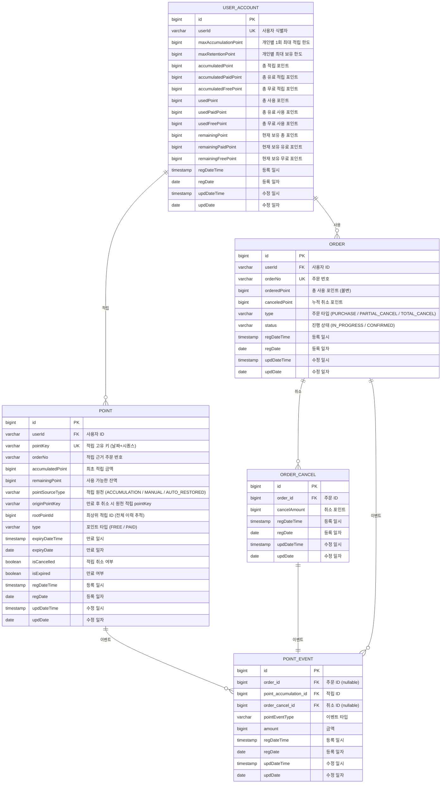

# 포인트 시스템 데이터베이스 설계

본 프로젝트의 데이터베이스 설계를 Mermaid ERD 다이어그램과 함께 상세히 설명합니다.

---

## ERD (Entity Relationship Diagram)

---

## 테이블 상세 설명

### 1. USER_ACCOUNT (사용자 계정)

사용자별 포인트 잔액 및 한도를 관리하는 핵심 테이블입니다.

| 컬럼 | 타입 | 설명 |
|------|------|------|
| id | bigint (PK) | 자동 증가 기본키 |
| userId | varchar (UK) | 사용자 식별자 (외부 시스템 ID) |
| maxAccumulationPoint | bigint | 개인별 1회 최대 적립 한도 |
| maxRetentionPoint | bigint | 개인별 최대 보유 한도 |
| accumulatedPoint | bigint | 총 적립 포인트 (유료 + 무료) |
| accumulatedPaidPoint | bigint | 총 유료 적립 포인트 |
| accumulatedFreePoint | bigint | 총 무료 적립 포인트 |
| usedPoint | bigint | 총 사용 포인트 (유료 + 무료) |
| usedPaidPoint | bigint | 총 유료 사용 포인트 |
| usedFreePoint | bigint | 총 무료 사용 포인트 |
| remainingPoint | bigint | 현재 보유 총 포인트 |
| remainingPaidPoint | bigint | 현재 보유 유료 포인트 |
| remainingFreePoint | bigint | 현재 보유 무료 포인트 |

**설계 포인트**
- 적립/사용/잔여 포인트를 각각 **총계 / 유료 / 무료** 3가지로 세분화하여 관리합니다.
- **비관적 락(Pessimistic Lock)** 을 통해 동시 요청 시 잔액 정합성을 보장합니다. (상세: [동시성 제어 전략](동시성%20제어.md))
- `maxAccumulationPoint`, `maxRetentionPoint`는 사용자별로 개별 설정 가능합니다.

---

### 2. POINT (적립 내역)

사용자가 적립한 포인트 건별 정보를 저장합니다.

| 컬럼 | 타입 | 설명 |
|------|------|------|
| id | bigint (PK) | 자동 증가 기본키 |
| userId | varchar (FK) | 사용자 ID |
| pointKey | varchar (UK) | 적립 고유 키 (날짜 + 시퀀스 조합) |
| orderNo | varchar | 적립 근거 주문 번호 |
| accumulatedPoint | bigint | 최초 적립 금액 (불변) |
| remainingPoint | bigint | 현재 사용 가능한 잔액 |
| pointSourceType | varchar | 적립 원천 (아래 Enum 참고) |
| originPointKey | varchar | 만료 후 취소 재적립 시 직전 적립 건의 pointKey |
| rootPointId | bigint | 최상위 적립 ID (전체 이력 체인 추적) |
| type | varchar | 포인트 타입 (FREE / PAID) |
| expiryDateTime | timestamp | 만료 일시 |
| expiryDate | date | 만료 일자 |
| isCancelled | boolean | 적립 취소 여부 |
| isExpired | boolean | 만료 여부 |

**Enum: PointSourceType (적립 원천)**

| 값 | 설명 |
|----|------|
| `ACCUMULATION` | 일반 적립 (주문/리뷰 등) |
| `MANUAL` | 수기 지급 (CS 처리 등) |
| `AUTO_RESTORED` | 만료 후 취소로 인한 자동 재지급 |

**Enum: PointType (포인트 타입)**

| 값 | 설명 |
|----|------|
| `FREE` | 무료 포인트 |
| `PAID` | 유료 포인트 |

**설계 포인트**
- `pointKey`는 날짜별 시퀀스로 생성됩니다.
- `originPointKey` → `rootPointId` 체인으로 재적립 이력을 완전히 추적할 수 있습니다.
- 사용 시 `remainingPoint`가 차감되며, `accumulatedPoint`는 불변입니다.
- 수기 지급(`MANUAL`) 포인트는 사용 우선순위가 가장 높습니다.

---

### 3. ORDER (사용/주문 내역)

포인트 사용 시 생성되는 주문 마스터 테이블입니다.

| 컬럼 | 타입 | 설명 |
|------|------|------|
| id | bigint (PK) | 자동 증가 기본키 |
| userId | varchar (FK) | 사용자 ID |
| orderNo | varchar (UK) | 주문 번호 (외부 시스템 제공) |
| orderedPoint | bigint | 주문 시 사용한 총 포인트 (불변) |
| canceledPoint | bigint | 누적 취소된 포인트 |
| type | varchar | 주문 타입 (아래 Enum 참고) |
| status | varchar | 진행 상태 (아래 Enum 참고) |

**Enum: OrderType (주문 타입)**

| 값 | 설명 |
|----|------|
| `PURCHASE` | 구매 (최초 사용) |
| `PARTIAL_CANCEL` | 부분 취소 |
| `TOTAL_CANCEL` | 전체 취소 |

**Enum: OrderStatus (주문 상태)**

| 값 | 설명 |
|----|------|
| `IN_PROGRESS` | 진행중 (취소 가능) |
| `CONFIRMED` | 확정 (취소 불가) |

**설계 포인트**
- `orderedPoint`는 불변이며, `canceledPoint`는 취소 시 누적됩니다.
- `orderedPoint - canceledPoint`가 취소 가능 잔여 금액이며, 이를 초과하는 취소는 불가합니다.
- `ORDER_ITEM` 테이블을 제거하고 주문 단위로 처리하여 구현 복잡도를 낮췄습니다.

---

### 4. ORDER_CANCEL (취소 이력)

주문 취소 건별 상세 이력을 저장합니다.

| 컬럼 | 타입 | 설명 |
|------|------|------|
| id | bigint (PK) | 자동 증가 기본키 |
| order_id | bigint (FK) | 주문 ID |
| cancelAmount | bigint | 해당 취소 건의 취소 포인트 |

**설계 포인트**
- 부분 취소가 여러 번 발생할 수 있으므로 `ORDER`와 1:N 관계입니다.
- 각 취소 건은 `POINT_EVENT`와 1:1로 연결되어 포인트 복원 이력을 추적합니다.

---

### 5. POINT_EVENT (포인트 이벤트 이력)

모든 포인트 활동(적립/사용/취소/만료 등)을 건별로 기록하는 이력 테이블입니다.

| 컬럼 | 타입 | 설명 |
|------|------|------|
| id | bigint (PK) | 자동 증가 기본키 |
| order_id | bigint (FK, nullable) | 주문 ID (사용/사용취소 시) |
| point_accumulation_id | bigint (FK) | 적립 ID |
| order_cancel_id | bigint (FK, nullable) | 취소 ID (사용취소 시) |
| pointEventType | varchar | 이벤트 타입 (아래 Enum 참고) |
| amount | bigint | 해당 이벤트 금액 |

**Enum: PointEventType (이벤트 타입)**

| 값 | 설명 |
|----|------|
| `ACCUMULATE` | 적립 (일반 적립 및 만료 후 재발급 포함) |
| `ACCUMULATE_CANCEL` | 적립 취소 |
| `USE` | 사용 |
| `USE_CANCEL` | 사용 취소 |
| `EXPIRE` | 만료 |
| `EXPIRED_CANCEL_RESTORE` | 만료 후 취소로 인한 재적립 |

**설계 포인트**
- 모든 포인트 변동을 **1원 단위**로 기록하여 완전한 감사 추적(Audit Trail)을 제공합니다.
- `point_accumulation_id`를 통해 어떤 적립 건에서 발생한 이벤트인지 추적합니다.
- `order_id`, `order_cancel_id`는 nullable로, 이벤트 타입에 따라 선택적으로 연결됩니다.
- 통계 집계(일별/월별/연도별)의 기반 데이터로 활용됩니다.

---

## 데이터 모델 설계 원칙

### 1. 테이블 간소화 및 직접 참조
- `ORDER_ITEM` 테이블을 제거하고 `ORDER` 테이블이 직접 취소(`ORDER_CANCEL`) 및 포인트 이벤트(`POINT_EVENT`)를 참조하도록 설계했습니다.
- 실제 비즈니스 환경에서는 `ORDER`와 `ITEM`이 1:N 관계를 맺어 아이템 단위의 부분 취소가 발생할 수 있으나, 본 과제에서는 구현 복잡도를 낮추고 포인트 핵심 로직에 집중하기 위해 주문 단위의 처리를 기본으로 하였습니다.

### 2. 공통 감사 컬럼 (BaseEntity)
모든 테이블은 `BaseEntity`를 상속받아 생성 및 수정 이력을 관리하는 공통 컬럼을 포함합니다.

| 컬럼 | 설명 |
|------|------|
| regDateTime | 레코드 생성 일시 (JPA Auditing 자동 설정) |
| regDate | 레코드 생성 일자 |
| updDateTime | 레코드 최종 수정 일시 (JPA Auditing 자동 설정) |
| updDate | 레코드 최종 수정 일자 |

- 데이터의 생성/변경 시점을 명확히 추적합니다.
- 대용량 데이터 환경에서 파티셔닝 키나 인덱스로 활용합니다.

---

## 성능 최적화 전략 (대용량 데이터 대응)

### 1. 인덱스 설계

조회 빈도가 높고 집계 작업이 많은 컬럼을 중심으로 인덱스를 구성하였습니다.

**POINT (적립 내역)**

| 인덱스명 | 컬럼 | 용도 |
|---------|------|------|
| idx_point_user_id_expiry_date | (userId, expiryDateTime, pointSourceType, isExpired) | 사용 가능 포인트 조회 (수기 지급 우선, 만료 임박순) |
| idx_point_accumulation_date | (regDateTime) | 일자별 적립 통계 집계 |
| idx_point_expiry_date | (expiryDateTime, isExpired) | 만료 처리 배치 작업 |
| idx_point_order_no | (orderNo) | 주문 기반 적립 내역 조회 |

**ORDER (사용/주문 내역)**

| 인덱스명 | 컬럼 | 용도 |
|---------|------|------|
| idx_order_user_id_usage_date | (userId, regDateTime) | 사용자별 사용 이력 최신순 조회 |
| idx_order_usage_date | (regDateTime) | 일자별 사용 통계 집계 |
| idx_order_order_no | (orderNo) | 주문 번호 기반 조회 |

**ORDER_CANCEL (취소 이력)**

| 인덱스명 | 컬럼 | 용도 |
|---------|------|------|
| idx_order_cancel_order_id | (order_id) | 주문별 취소 이력 조회 |

**POINT_EVENT (이벤트 이력)**

| 인덱스명 | 컬럼 | 용도 |
|---------|------|------|
| idx_pd_order_id | (order_id) | 주문 단위 포인트 추적 |
| idx_pd_point_accumulation_id | (point_accumulation_id) | 적립 건별 이벤트 조회 |
| idx_pd_order_cancel_id | (order_cancel_id) | 취소 건 복원 이력 조회 |

### 2. 파티셔닝 전략

H2 Database는 파티셔닝을 지원하지 않으나, 대용량 서비스 환경(MySQL, PostgreSQL, Oracle 등)에서는 아래 전략을 권장합니다.

**Range Partitioning (날짜 기반)**

| 항목 | 내용 |
|------|------|
| 대상 테이블 | POINT, ORDER, POINT_EVENT |
| 파티션 키 | regDateTime (생성 일시) |
| 장점 | 일자별/월별 집계 성능 향상, 오래된 데이터 Archiving/Purge 효율화, I/O 최소화 |

**Hash Partitioning (사용자 ID 기반)**

| 항목 | 내용 |
|------|------|
| 대상 테이블 | USER_ACCOUNT |
| 파티션 키 | userId |
| 장점 | 대규모 사용자 환경에서 쓰기 부하 분산 |

---

## 포인트 사용 우선순위

포인트 사용 시 아래 우선순위에 따라 차감됩니다.

1. **수기 지급 포인트** (`pointSourceType = MANUAL`) — 최우선 차감
2. **만료 임박 포인트** (`expiryDateTime` 오름차순)
3. **무료 포인트** (`type = FREE`) 우선, 이후 **유료 포인트** (`type = PAID`)

---

## 관련 문서

- [요구사항](요구사항.md)
- [아키텍처 구성](아키텍처%20구성.md)
- [동시성 제어 전략](동시성%20제어.md)
- [시나리오 흐름](시나리오%20흐름.md)
- [Admin 기획서](Admin%20기획서.md)
