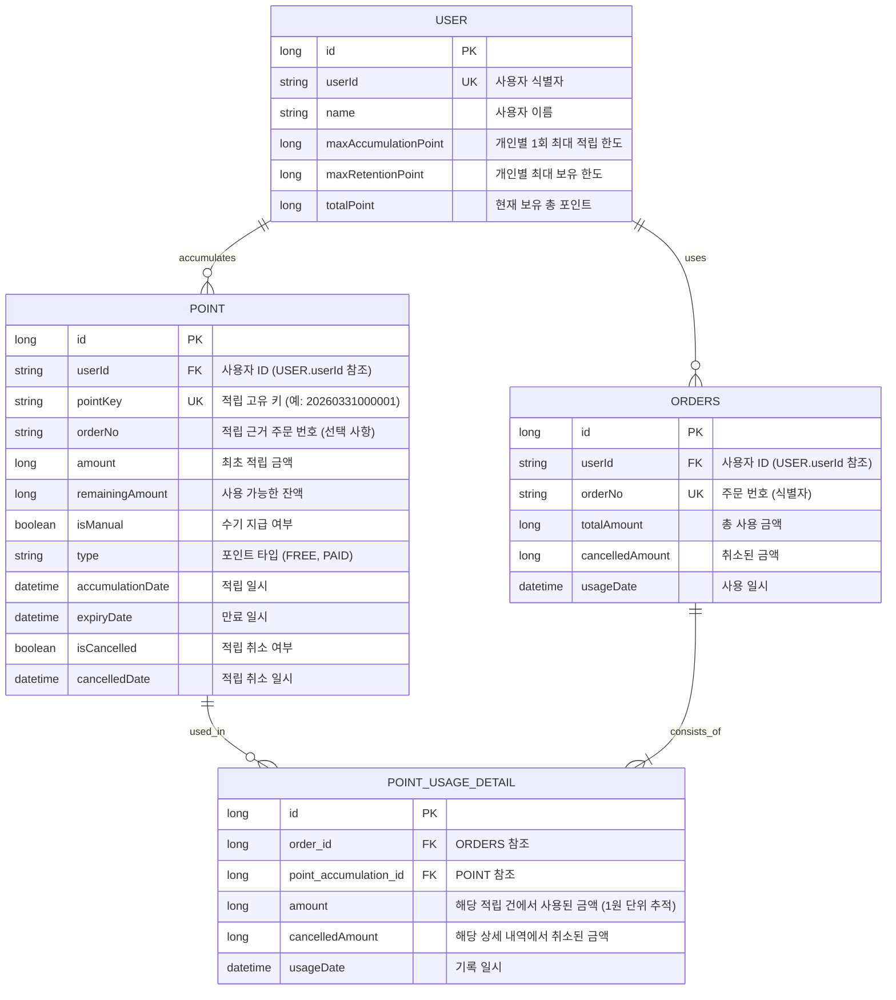

# 포인트 시스템 ERD

본 프로젝트의 데이터베이스 설계를 Mermaid 다이어그램으로 나타냅니다.

### 성능 최적화 전략 (대용량 데이터 대응)

대량의 데이터가 발생하는 포인트 시스템의 특성을 고려하여 아래와 같은 성능 최적화 전략을 설계하였습니다.

#### 1. 인덱스 설계 (Index Design)
조회 빈도가 높고 집계 작업이 많은 컬럼을 중심으로 인덱스를 구성하였습니다.

- **POINT (적립 내역)**
    - `idx_point_user_id_expiry_date`: `(userId, expiryDate, isManual)`
        - 사용자의 가용 포인트를 조회할 때(만료 임박순, 수기 지급 우선) 최적의 성능을 냅니다.
    - `idx_point_accumulation_date`: `(accumulationDate)`
        - 일자별 적립 통계 및 집계 쿼리에 사용됩니다.
    - `idx_point_expiry_date`: `(expiryDate)`
        - 만료 처리 배치 작업 시 성능을 향상시킵니다.
    - `idx_point_order_no`: `(orderNo)`
        - 특정 주문에 의한 적립 내역 조회 시 사용됩니다.

- **ORDERS (사용/주문 내역)**
    - `idx_orders_user_id_usage_date`: `(userId, usageDate)`
        - 특정 사용자의 사용 이력을 최신순으로 조회할 때 유용합니다.
    - `idx_orders_usage_date`: `(usageDate)`
        - 일자별 사용 통계 및 집계 쿼리에 사용됩니다.
    - `idx_orders_order_no`: `(orderNo)`
        - 주문 번호 기반 조회 시 성능을 보장합니다.

- **POINT_USAGE_DETAIL (사용 상세)**
    - `idx_pud_order_id`, `idx_pud_point_accumulation_id`
        - 조인 성능 향상 및 이력 추적을 위한 외래키 인덱스입니다.

#### 2. 파티셔닝 전략 (Partitioning Strategy)
H2 Database는 기본적으로 파티셔닝 기능을 지원하지 않으나, 대용량 서비스 환경(MySQL, PostgreSQL, Oracle 등)에서는 아래와 같은 파티셔닝 전략을 권장합니다.

- **Range Partitioning (날짜 기반)**
    - **대상 테이블**: `POINT`, `ORDERS`, `POINT_USAGE_DETAIL`
    - **파티션 키**: `accumulationDate`, `usageDate` 등 날짜 컬럼
    - **장점**: 
        - 일자별/월별 집계 쿼리 성능이 대폭 향상됩니다.
        - 오래된 이력 데이터를 보관/삭제(Archiving/Purge)할 때 파티션 단위로 작업하여 DB 부하를 최소화할 수 있습니다.
        - 특정 기간의 데이터만 스캔하므로 I/O 효율이 좋아집니다.

- **Hash Partitioning (사용자 ID 기반)**
    - **대상 테이블**: `USER`
    - **파티션 키**: `userId`
    - **장점**: 대규모 사용자 환경에서 쓰기 부하를 여러 데이터 파일로 분산시킬 수 있습니다.

### 테이블 설명

1. **USER (사용자)**
    - 개인별 1회 최대 적립 한도(`maxAccumulationPoint`), 최대 보유 한도(`maxRetentionPoint`)와 현재 잔액(`totalPoint`)을 관리합니다.
    - **비관적 락**을 통해 동시성 제어가 필요한 핵심 레코드입니다. (상세 내용: [동시성 제어 전략](동시성%20제어.md))

2. **POINT (적립 내역)**
    - 사용자가 적립한 포인트 정보를 저장합니다.
    - `orderNo`를 기록하여 어떤 주문의 근거로 적립된 포인트인지 식별합니다. (예: 리뷰 작성, 구매 보상 등)
    - `remainingAmount`를 통해 현재 사용 가능한 잔액을 관리합니다.
    - `isManual` 필드로 관리자 수기 지급 여부를 구분합니다.
    - `type` 필드로 포인트의 성격(무료/유료)을 구분합니다.
    - `expiryDate`를 통해 만료 여부를 판단합니다.

3. **ORDERS (사용/주문 내역)**
    - 주문 시 발생한 포인트 사용 마스터 정보를 저장합니다.
    - `orderNo`를 고유 식별자로 사용하여 어떤 주문에서 사용되었는지 식별합니다.
    - `totalAmount` 및 `cancelledAmount`를 통해 사용 및 취소 현황을 관리합니다.

4. **POINT_USAGE_DETAIL (사용 상세 내역)**
    - 특정 주문 건(`ORDERS`)이 어떤 적립 건(`POINT`)에서 얼마만큼 차감되었는지 1원 단위로 기록합니다.
    - 이를 통해 적립-사용 간의 관계를 명확히 추적하며, 사용 취소 시 복구할 대상을 정확히 찾아낼 수 있습니다.

5. **POINT_KEY_SEQUENCE (키 시퀀스 관리)**
    - 일자별로 적립 키의 시퀀스 번호를 관리합니다.
    - `sequenceDate`별로 `lastSequence`를 유지하며, 비관적 락을 통해 안전하게 증분합니다.
    - (사용(주문)은 자체 orderNo를 사용하므로 적립 시에만 주로 활용됩니다.)
