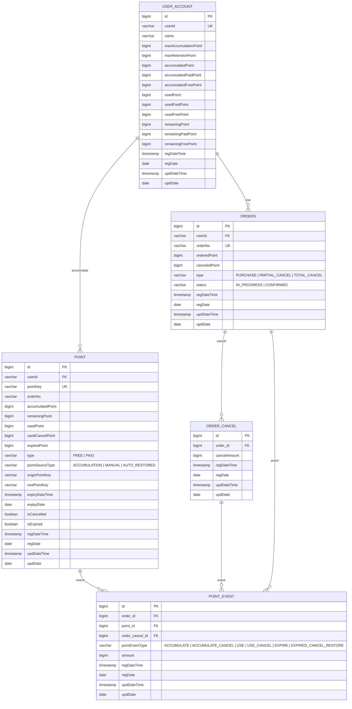

# 🗄️ 포인트 시스템 데이터베이스 설계

본 프로젝트의 데이터베이스 설계를 Mermaid ERD 다이어그램과 함께 상세히 설명합니다.

---

## 🧱 BaseEntity

모든 테이블은 `BaseEntity`를 상속받아 아래 공통 컬럼을 포함합니다.

| 컬럼 | 설명 |
|------|------|
| regDateTime | 레코드 생성 일시 (JPA Auditing 자동 설정) |
| regDate | 레코드 생성 일자 |
| updDateTime | 레코드 최종 수정 일시 (JPA Auditing 자동 설정) |
| updDate | 레코드 최종 수정 일자 |

---

## 🔗 ERD (Entity Relationship Diagram)

---

## 📋 테이블 상세 설명

---

<strong>1. 👤 USER_ACCOUNT (사용자 계정)</strong>

사용자별 포인트 잔액 및 한도를 관리하는 핵심 테이블입니다.

| 컬럼 | 타입 | 설명 |
|------|------|------|
| id | bigint (PK) | 자동 증가 기본키 |
| userId | varchar (UK) | 사용자 식별자 (외부 시스템 ID) |
| maxAccumulationPoint | bigint | 개인별 1회 최대 적립 한도 |
| maxRetentionPoint | bigint | 개인별 최대 보유 한도 |
| accumulatedPoint | bigint | 총 적립 포인트 (유료 + 무료) |
| accumulatedPaidPoint | bigint | 총 유료 적립 포인트 |
| accumulatedFreePoint | bigint | 총 무료 적립 포인트 |
| usedPoint | bigint | 총 사용 포인트 (유료 + 무료) |
| usedPaidPoint | bigint | 총 유료 사용 포인트 |
| usedFreePoint | bigint | 총 무료 사용 포인트 |
| remainingPoint | bigint | 현재 보유 총 포인트 |
| remainingPaidPoint | bigint | 현재 보유 유료 포인트 |
| remainingFreePoint | bigint | 현재 보유 무료 포인트 |

**💡 설계 포인트**
- 적립/사용/잔여 포인트를 각각 **총계 / 유료 / 무료** 3가지로 세분화하여 관리합니다.
- **비관적 락(Pessimistic Lock)** 을 통해 동시 요청 시 잔액 정합성을 보장합니다. (상세: [동시성 제어 전략](동시성%20제어.md))
- `maxAccumulationPoint`, `maxRetentionPoint`는 사용자별로 개별 설정 가능합니다.

---

<strong>2. 💰 POINT (적립 내역)</strong>

사용자가 적립한 포인트 건별 정보를 저장합니다.

| 컬럼 | 타입 | 설명 | 비고 |
|------|------|------|------|
| id | bigint (PK) | 자동 증가 기본키 | |
| userId | varchar (FK) | 사용자 ID | |
| pointKey | varchar (UK) | 적립 고유 키 | 날짜 + 시퀀스 조합 |
| orderNo | varchar | 적립 근거 주문 번호 | |
| accumulatedPoint | bigint | 최초 적립 금액 | 불변 |
| remainingPoint | bigint | 현재 사용 가능한 잔액 | |
| usedPoint | bigint | 누적 사용 금액 | |
| usedCancelPoint | bigint | 누적 사용 취소 금액 | |
| expiredPoint | bigint | 만료된 금액 | |
| type | varchar | 포인트 타입 | `FREE` 무료 포인트 / `PAID` 유료 포인트 |
| pointSourceType | varchar | 적립 원천 | `ACCUMULATION` 일반 적립 / `MANUAL` 수기 지급(CS 처리, 사용 시 최우선 차감) / `AUTO_RESTORED` 만료 후 취소로 인한 자동 재지급 |
| originPointKey | varchar | 직전 적립 건의 pointKey | 만료 후 취소 재적립 시 연결 |
| rootPointKey | varchar | 최상위 적립 pointKey | 전체 이력 체인 추적용 |
| expiryDateTime | timestamp | 만료 일시 | |
| expiryDate | date | 만료 일자 | |
| isCancelled | boolean | 적립 취소 여부 | |
| isExpired | boolean | 만료 여부 | |

**💡 설계 포인트**
- `originPointKey` → `rootPointKey` 체인으로 재적립 이력을 완전히 추적할 수 있습니다.
- 사용 시 `remainingPoint`가 차감되며, `accumulatedPoint`는 불변입니다.
- 수기 지급(`MANUAL`) 포인트는 사용 우선순위가 가장 높습니다.

#### 🗂️ 인덱스

| 인덱스명 | 컬럼 | 용도 |
|---------|------|------|
| idx_point_user_id | userId | 사용자별 포인트 조회 |
| idx_point_expiry_date | expiryDateTime | 만료 처리 배치 작업 |
| idx_point_reg_date_time | regDateTime | 일자별 적립 통계 집계 (일시) |
| idx_point_reg_date | regDate | 일자별 적립 통계 집계 (날짜) |
| idx_point_order_no | orderNo | 주문 기반 적립 내역 조회 |

---

<strong>3. 🛒 ORDERS (사용/주문 내역)</strong>

포인트 사용 시 생성되는 주문 마스터 테이블입니다.

| 컬럼 | 타입 | 설명 | 비고 |
|------|------|------|------|
| id | bigint (PK) | 자동 증가 기본키 | |
| userId | varchar (FK) | 사용자 ID | |
| orderNo | varchar (UK) | 주문 번호 | 외부 시스템 제공 |
| orderedPoint | bigint | 주문 시 사용한 총 포인트 | 불변 |
| canceledPoint | bigint | 누적 취소된 포인트 | |
| type | varchar | 주문 타입 | `PURCHASE` 구매(최초 사용) / `PARTIAL_CANCEL` 부분 취소 / `TOTAL_CANCEL` 전체 취소 |
| status | varchar | 진행 상태 | `IN_PROGRESS` 진행중(취소 가능) / `CONFIRMED` 확정(취소 불가) |

**💡 설계 포인트**
- `orderedPoint`는 불변이며, `canceledPoint`는 취소 시 누적됩니다.
- `orderedPoint - canceledPoint`가 취소 가능 잔여 금액이며, 이를 초과하는 취소는 불가합니다.
- `ORDER_ITEM` 테이블을 제거하고 주문 단위로 처리하여 구현 복잡도를 낮췄습니다.

#### 🗂️ 인덱스

| 인덱스명 | 컬럼 | 용도 |
|---------|------|------|
| idx_order_user_id | userId | 사용자별 사용 이력 조회 |
| idx_order_reg_date_time | regDateTime | 일자별 사용 통계 집계 (일시) |
| idx_order_reg_date | regDate | 일자별 사용 통계 집계 (날짜) |
| idx_order_order_no | orderNo | 주문 번호 기반 조회 |

---

<strong>4. ↩️ ORDER_CANCEL (취소 내역)</strong>

주문 취소 시 생성되는 취소 이력 테이블입니다.

| 컬럼 | 타입 | 설명 | 비고 |
|------|------|------|------|
| id | bigint (PK) | 자동 증가 기본키 | |
| order_id | bigint (FK) | 원본 주문 ID | |
| cancelAmount | bigint | 이번 취소 금액 | |

**💡 설계 포인트**
- 취소 1건당 1개의 레코드가 생성됩니다.
- 부분 취소가 여러 번 발생하면 `order_id`가 동일한 레코드가 여러 개 존재합니다.
- `POINT_EVENT`와 연결되어 취소로 인한 포인트 복원 이력을 추적합니다.

#### 🗂️ 인덱스

| 인덱스명 | 컬럼 | 용도 |
|---------|------|------|
| idx_oc_order_id | order_id | 주문별 취소 이력 조회 |

---

<strong>5. 📜 POINT_EVENT (포인트 이벤트 이력)</strong>

모든 포인트 활동(적립/사용/취소/만료 등)을 건별로 기록하는 이력 테이블입니다.

| 컬럼 | 타입 | 설명 | 비고 |
|------|------|------|------|
| id | bigint (PK) | 자동 증가 기본키 | |
| order_id | bigint (FK) | 주문 ID | nullable, 사용/사용취소 시 연결 |
| point_id | bigint (FK) | 적립 ID | |
| order_cancel_id | bigint (FK) | 취소 ID | nullable, 사용취소 시 연결 |
| pointEventType | varchar | 이벤트 타입 | `ACCUMULATE` 적립 / `ACCUMULATE_CANCEL` 적립취소 / `USE` 사용 / `USE_CANCEL` 사용취소 / `EXPIRE` 만료 / `EXPIRED_CANCEL_RESTORE` 만료 후 취소로 인한 재적립 |
| amount | bigint | 해당 이벤트 금액 | |

**💡 설계 포인트**
- 모든 포인트 변동을 **1원 단위**로 기록하여 완전한 감사 추적을 제공합니다.
- `point_id`를 통해 어떤 적립 건에서 발생한 이벤트인지 추적합니다.
- 통계 집계(일별/월별/연도별)의 기반 데이터로 활용됩니다.

#### 🗂️ 인덱스

| 인덱스명 | 컬럼 | 용도 |
|---------|------|------|
| idx_pd_order_id | order_id | 주문 단위 포인트 추적 |
| idx_pd_point_id | point_id | 적립 건별 이벤트 조회 |
| idx_pd_order_cancel_id | order_cancel_id | 취소 건 복원 이력 조회 |
| idx_pd_reg_date_time | regDateTime | 일자별 이벤트 통계 집계 (일시) |
| idx_pd_reg_date | regDate | 일자별 이벤트 통계 집계 (날짜) |

---

<strong>6. 🔑 POINT_KEY_SEQUENCE (포인트 키 시퀀스)</strong>

날짜별 포인트 키 시퀀스를 관리하는 테이블입니다.

| 컬럼 | 타입 | 설명 |
|------|------|------|
| id | bigint (PK) | 자동 증가 기본키 |
| sequenceDate | date (UK) | 시퀀스 기준 날짜 |
| lastSequence | bigint | 해당 날짜의 마지막 시퀀스 번호 |

**🔢 pointKey 생성 방식**

포인트 키는 `yyyyMMdd + 6자리 시퀀스` 형식으로 생성됩니다. (예: `20260401000001`)

날짜가 바뀌면 새 레코드가 생성되고 시퀀스는 1부터 다시 시작합니다.

**🔒 동시성 제어**

시퀀스 조회 시 비관적 락(Pessimistic Lock)을 적용하여 동일 날짜에 여러 요청이 동시에 들어와도 중복 키가 생성되지 않도록 보장합니다.

---

## 📦 파티셔닝 전략

H2 Database는 파티셔닝을 지원하지 않으나, 대용량 서비스 환경(MySQL, PostgreSQL 등)에서는 아래 전략을 권장합니다.

**📅 Range Partitioning (날짜 기반)**

| 항목 | 내용 |
|------|------|
| 대상 테이블 | POINT, ORDERS, POINT_EVENT |
| 파티션 키 | regDateTime (생성 일시) |
| 장점 | 일자별/월별 집계 성능 향상, 오래된 데이터 정리 효율화 |
