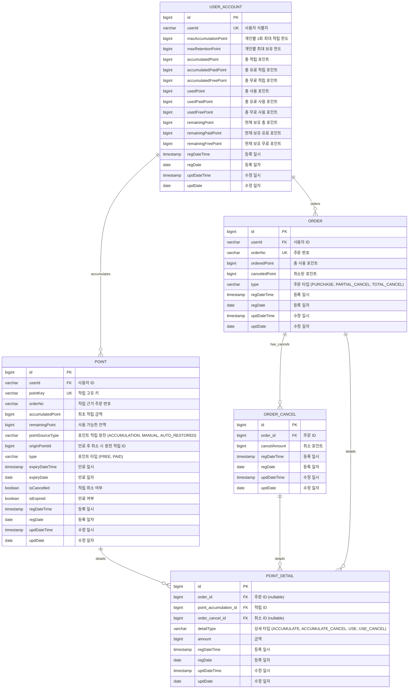

# 포인트 시스템 ERD

본 프로젝트의 데이터베이스 설계를 Mermaid 다이어그램으로 나타냅니다.

### 데이터 모델 설계 원칙

1. **테이블 간소화 및 직접 참조**
    - `ORDER_ITEM` 테이블을 제거하고 `ORDER` 테이블이 직접 취소(`ORDER_CANCEL`) 및 포인트 상세(`POINT_DETAIL`)를 참조하도록 설계했습니다.
    - 실제 비즈니스 환경에서는 `ORDER`와 `ITEM`이 1:N 관계를 맺어 아이템 단위의 부분 취소가 발생할 수 있으나, 본 과제에서는 구현 복잡도를 낮추고 포인트 핵심 로직에 집중하기 위해 주문 단위의 처리를 기본으로 하였습니다.

2. **공통 감사 컬럼 (BaseEntity)**
    - 모든 테이블은 `BaseEntity`를 상속받아 생성 및 수정 이력을 관리하는 공통 컬럼을 포함합니다.
    - `regDateTime`, `regDate`: 레코드 생성 일시 및 일자 (JPA Auditing 활용)
    - `updDateTime`, `updDate`: 레코드 최종 수정 일시 및 일자 (JPA Auditing 활용)
    - 이를 통해 데이터의 생성/변경 시점을 명확히 추적하며, 대용량 데이터 환경에서의 파티셔닝 키나 인덱스로 활용합니다.

### 성능 최적화 전략 (대용량 데이터 대응)

대량의 데이터가 발생하는 포인트 시스템의 특성을 고려하여 아래와 같은 성능 최적화 전략을 설계하였습니다.

#### 1. 인덱스 설계 (Index Design)
조회 빈도가 높고 집계 작업이 많은 컬럼을 중심으로 인덱스를 구성하였습니다.

- **POINT (적립 내역)**
    - `idx_point_user_id_expiry_date`: `(userId, expiryDateTime, pointSourceType, isExpired)`
        - 사용자의 가용 포인트를 조회할 때(수기 지급 우선, 만료 임박순, 미만료 상태) 최적의 성능을 냅니다.
    - `idx_point_accumulation_date`: `(regDateTime)`
        - 일자별 적립 통계 및 집계 쿼리에 사용됩니다.
    - `idx_point_expiry_date`: `(expiryDateTime, isExpired)`
        - 만료 처리 배치 작업 시 성능을 향상시킵니다.
    - `idx_point_order_no`: `(orderNo)`
        - 특정 주문에 의한 적립 내역 조회 시 사용됩니다.

- **ORDER (사용/주문 내역)**
    - `idx_order_user_id_usage_date`: `(userId, regDateTime)`
        - 특정 사용자의 사용 이력을 최신순으로 조회할 때 유용합니다.
    - `idx_order_usage_date`: `(regDateTime)`
        - 일자별 사용 통계 및 집계 쿼리에 사용됩니다.
    - `idx_order_order_no`: `(orderNo)`
        - 주문 번호 기반 조회 시 성능을 보장합니다.

- **ORDER_CANCEL (취소 이력)**
    - `idx_order_cancel_order_id`
        - 주문별 취소 이력 조회용 외래키 인덱스입니다.

- **POINT_DETAIL (상세 이력)**
    - `idx_pd_order_id`, `idx_pd_point_accumulation_id`
        - 주문 단위 포인트 추적 및 조인 성능 향상을 위한 인덱스입니다.
    - `idx_pd_order_cancel_id`
        - 취소 건에 의해 복구된 상세 내역 조회용 인덱스입니다.

#### 2. 파티셔닝 전략 (Partitioning Strategy)
H2 Database는 기본적으로 파티셔닝 기능을 지원하지 않으나, 대용량 서비스 환경(MySQL, PostgreSQL, Oracle 등)에서는 아래와 같은 파티셔닝 전략을 권장합니다.

- **Range Partitioning (날짜 기반)**
    - **대상 테이블**: `POINT`, `ORDER`, `POINT_DETAIL`
    - **파티션 키**: `regDateTime` 등 날짜 컬럼
    - **장점**: 
        - 일자별/월별 집계 쿼리 성능이 대폭 향상됩니다.
        - 오래된 이력 데이터를 보관/삭제(Archiving/Purge)할 때 파티션 단위로 작업하여 DB 부하를 최소화할 수 있습니다.
        - 특정 기간의 데이터만 스캔하므로 I/O 효율이 좋아집니다.

- **Hash Partitioning (사용자 ID 기반)**
    - **대상 테이블**: `USER_ACCOUNT`
    - **파티션 키**: `userId`
    - **장점**: 대규모 사용자 환경에서 쓰기 부하를 여러 데이터 파일로 분산시킬 수 있습니다.

### 테이블 설명

1. **USER_ACCOUNT (사용자 계정)**
    - 개인별 1회 최대 적립 한도(`maxAccumulationPoint`), 최대 보유 한도(`maxRetentionPoint`)와 현재 잔액(`remainingPoint`)을 관리합니다.
    - 적립, 사용, 잔여 포인트에 대해 각각 총계, 유료, 무료 컬럼을 세분화하여 관리합니다.
        - 적립: `accumulatedPoint`, `accumulatedPaidPoint`, `accumulatedFreePoint`
        - 사용: `usedPoint`, `usedPaidPoint`, `usedFreePoint`
        - 잔여: `remainingPoint`, `remainingPaidPoint`, `remainingFreePoint`
    - **비관적 락**을 통해 동시성 제어가 필요한 핵심 레코드입니다. (상세 내용: [동시성 제어 전략](동시성%20제어.md))

2. **POINT (적립 내역)**
    - 사용자가 적립한 포인트 정보를 저장합니다.
    - `orderNo`를 기록하여 어떤 주문의 근거로 적립된 포인트인지 식별합니다. (예: 리뷰 작성, 구매 보상 등)
    - `remainingPoint`를 통해 현재 사용 가능한 잔액을 관리합니다.
    - `pointSourceType` 필드로 적립 원천(일반 적립, 수기 지급, 만료 후 취소 재적립)을 구분합니다.
    - `originPointId` 필드로 재적립 시 원본 적립 건을 추적합니다.
    - `type` 필드로 포인트의 성격(무료/유료)을 구분합니다.
    - `expiryDateTime` 및 `isExpired`를 통해 만료 여부를 판단하고 관리합니다.

3. **ORDER (사용/주문 내역)**
    - 주문 시 발생한 포인트 사용 마스터 정보를 저장합니다.
    - `orderNo`를 고유 식별자로 사용하여 어떤 주문에서 사용되었는지 식별합니다.
    - `orderedPoint` 및 `canceledPoint`를 통해 사용 및 취소 현황을 관리합니다.
    - `type` 필드로 주문의 성격(구매, 부분 취소, 전체 취소)을 구분합니다.

4. **POINT_DETAIL (포인트 상세 내역)**
    - 적립, 적립 취소, 사용, 사용 취소 등 모든 포인트 활동을 1원 단위로 기록합니다.
    - `detailType`을 통해 활동 성격을 구분하며, 적립 건(`POINT`) 및 주문 건(`ORDER`)과 연관되어 포인트의 흐름을 명확히 추적합니다.

5. **POINT_KEY_SEQUENCE (키 시퀀스 관리)**
    - 일자별로 적립 키의 시퀀스 번호를 관리합니다.
    - `sequenceDate`별로 `lastSequence`를 유지하며, 비관적 락을 통해 안전하게 증분합니다.
    - `regDateTime`, `regDate`, `updDateTime`, `updDate`를 통해 생성 및 수정 이력을 관리합니다.
    - (사용(주문)은 자체 orderNo를 사용하므로 적립 시에만 주로 활용됩니다.)
