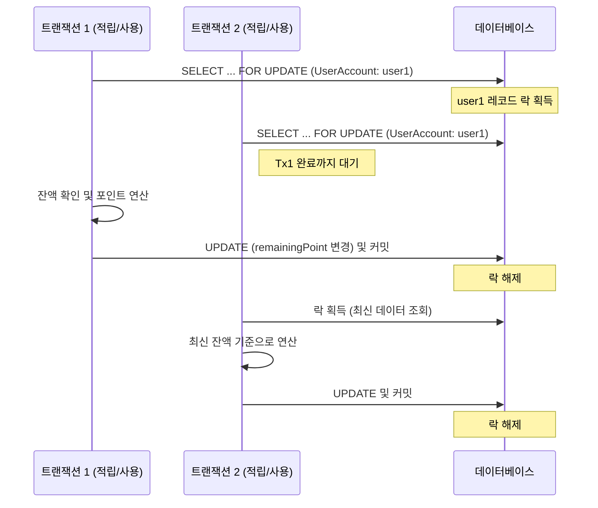

# 잔액(UserAccount.remainingPoint) 동시성 제어

### 문제 상황

한 사용자가 동시에 여러 건의 포인트 적립 또는 사용 요청을 보낼 경우, 두 트랜잭션이 동시에 `remainingPoint`를 읽고 수정하면서 **Lost Update** 현상이 발생할 수 있다.

- 잔액이 부정확하게 계산되거나
- 개인별 보유 한도를 초과하여 적립되는 등의 오류가 발생할 수 있음

---

### Redis 분산 락 vs DB 비관적 락 비교

#### Redis 분산 락

**장점**
- 애플리케이션 레벨에서 락을 제어하므로 DB 부하 없이 빠르게 동작
- 분산 환경(멀티 인스턴스)에서도 동일하게 적용 가능

**단점 (포기하게 되는 것)**
- TTL 만료나 Redis 장애 시 락이 풀려 정합성이 깨질 수 있음
- 락 획득 실패 시 재시도 로직을 직접 구현해야 함
- Redis 서버 추가 운영 필요 (장애 대응, TTL 튜닝 등 운영 부담 증가)

---

#### DB 비관적 락 (SELECT FOR UPDATE)

**장점**
- 트랜잭션 커밋/롤백과 생명주기가 같아 정합성이 확실하게 보장됨
- 별도 인프라 없이 DB만으로 동작
- DB가 대기 후 자동으로 락을 획득하므로 재시도 로직 불필요

**단점 (포기하게 되는 것)**
- 락 경합이 많을 경우 대기 시간 발생 (처리량 저하 가능)
- 단일 DB에 의존하므로 DB 자체가 병목이 될 수 있음

---

### DB 비관적 락 채택 이유

**Redis 분산 락도 고민했으나, 아래 이유로 DB 비관적 락을 선택했다.**

1. **외부 인프라 없이 정합성 보장**
   Redis 분산 락은 TTL 만료나 Redis 장애 시 락이 풀려 정합성이 깨질 수 있다. DB 비관적 락은 트랜잭션과 생명주기가 같아 커밋 또는 롤백 시점에 락이 반드시 해제되므로 정합성이 더 확실하다.

2. **포인트는 현금과 유사한 가치**
   잔액 오류가 발생했을 때의 비용이 크기 때문에, 성능보다 정합성을 우선했다.

3. **락 범위가 사용자 단위로 한정**
   `UserAccount` 레코드 단위로 락이 걸리므로, 서로 다른 사용자의 요청은 서로 영향을 주지 않는다. 전체 시스템 성능에 미치는 영향이 제한적이다.

4. **현 과제 범위에서 Redis는 과도한 의존성**
   Redis를 도입하면 장애 대응, TTL 튜닝, 재시도 로직 등 운영 복잡도가 높아진다. 현재 시스템 범위에서는 DB 락으로 충분하다고 판단했다.

---

### 동작 흐름

---

### 구현

#### Repository ([UserAccountRepository.java](../src/main/java/org/musinsa/payments/point/repository/UserAccountRepository.java))
- `@Lock(LockModeType.PESSIMISTIC_WRITE)` 로 `SELECT ... FOR UPDATE` 실행

#### Service ([PointService.java](../src/main/java/org/musinsa/payments/point/service/PointService.java))
- `accumulate`, `use`, `cancelUsage`, `cancelAccumulation` 등 주요 메서드 시작 시점에 `findByUserIdWithLock` 호출하여 락 획득
