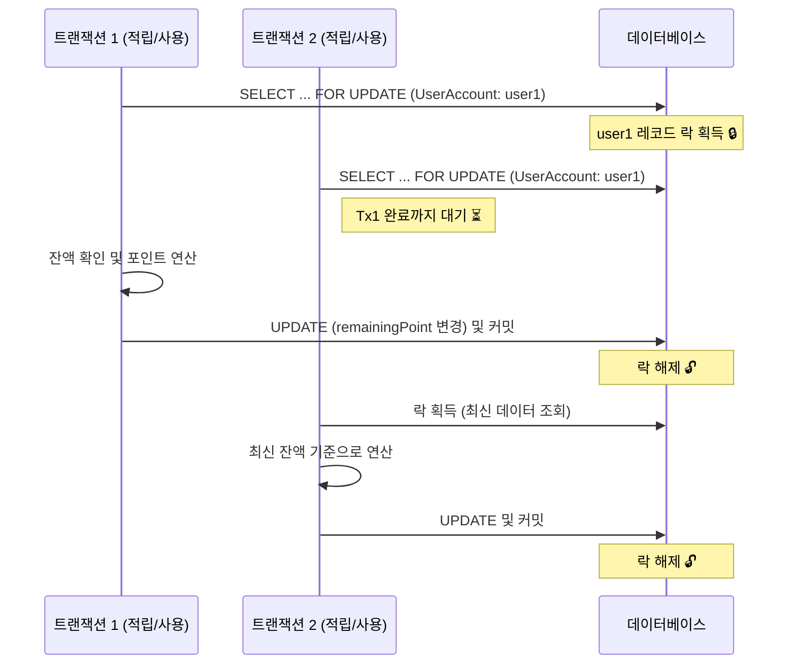

# ⚡ 잔액(UserAccount.remainingPoint) 동시성 제어

## 🚨 문제 상황

한 사용자가 동시에 여러 건의 포인트 요청을 보낼 경우,  
두 트랜잭션이 동시에 `remainingPoint`를 읽고 수정하면서 **Lost Update** 현상이 발생할 수 있다.

> ⚠️ 잔액이 부정확하게 계산되거나, 개인별 보유 한도를 초과하여 적립되는 오류가 발생할 수 있음

## 🔒 해결 방법

`UserAccount` 조회 시 `SELECT ... FOR UPDATE`(비관적 락)를 사용하여,  
동일 사용자에 대한 요청을 **직렬화**한다.  
락을 획득한 트랜잭션이 완료될 때까지 다른 트랜잭션은 대기하며, 항상 최신 잔액을 기준으로 연산한다.

---

## 🔄 동작 흐름

---

## 🤔 DB 락 채택 이유

### 1. 💳 결제시스템의 TPS는 생각보다 낮을 수 있다

[무신사 관련 기사](https://www.hankyung.com/article/202603319745i)를 참고해 대략적인 TPS를 산출해봤습니다.

- 이벤트 기준 DAU(Daily Active Users, 하루 동안 실제로 서비스를 이용한 사용자 수) 약 300만, 패션 커머스 구매 전환율 5% 가정 → **일 15만 주문**
- 피크 시간대 30% 집중 가정 → 시간당 45,000건 → **평균 피크 약 12.5 TPS**

이 TPS에서 락 경합이 실제로 문제가 되려면, **동일 사용자에게 동시에 수십 건의 요청이 집중**되어야 한다.  
락은 `UserAccount` row 단위이므로, 40 TPS가 발생해도 그것은 서로 다른 40명의 요청이지 같은 사람의 40건이 아니다.

일반적인 DB는 수백~수천 개의 row lock을 동시에 처리할 수 있으며,
이 수준의 TPS에서는 DB 비관적 락으로 충분히 감당 가능하다고 판단했습니다.

([PostgreSQL 기준](https://www.postgresql.org/docs/current/runtime-config-locks.html), 기본 설정 기준 약 6,400개의 lock을 동시 수용)

### 2. 👥 락이 걸렸을 때 영향을 받는 유저가 적다

락은 `UserAccount`의 **row 단위**로 잡힌다.  
즉, user1의 요청이 락을 잡고 있어도 user2, user3의 요청은 전혀 영향을 받지 않는다.

DB 락이 실질적으로 부하가 되는 상황은 **"동일 유저 요청 폭주"** 일 때다.

### 3. ⏱️ 락을 잡고 있는 시간이 짧다

포인트 적립/사용/취소 로직은 **DB 연산만 수행**하며, 외부 API 호출이나 네트워크 I/O가 없다.  
락을 획득한 트랜잭션이 빠르게 완료되므로, 대기 중인 트랜잭션의 지연 시간도 미미하다.

⚖️ Redis 분산 락 vs DB 비관적 락 비교

 

#### 🟥 Redis 분산 락

**✅ 장점**
- 애플리케이션 레벨에서 락을 제어하므로 DB 부하 없이 빠르게 동작
- 분산 환경(멀티 인스턴스)에서도 동일하게 적용 가능

**❌ 단점 (포기하게 되는 것)**
- TTL 만료나 Redis 장애 시 락이 풀려 정합성이 깨질 수 있음
- 락 획득 실패 시 재시도 로직을 직접 구현해야 함
- Redis 서버 추가 운영 필요 (장애 대응, TTL 튜닝 등 운영 부담 증가)

#### 🟦 DB 비관적 락 (SELECT FOR UPDATE)

**✅ 장점**
- 트랜잭션 커밋/롤백과 생명주기가 같아 정합성이 확실하게 보장됨
- 별도 인프라 없이 DB만으로 동작
- DB가 대기 후 자동으로 락을 획득하므로 재시도 로직 불필요

**❌ 단점 (포기하게 되는 것)**
- 락 경합이 많을 경우 대기 시간 발생 (처리량 저하 가능)
- 단일 DB에 의존하므로 DB 자체가 병목이 될 수 있음

---

## 🛠️ 구현

**Repository** — [UserAccountRepository.java](../src/main/java/org/musinsa/payments/point/repository/UserAccountRepository.java)
- `@Lock(LockModeType.PESSIMISTIC_WRITE)` 로 `SELECT ... FOR UPDATE` 실행

**Service** — [PointService.java](../src/main/java/org/musinsa/payments/point/service/PointService.java)
- `accumulate`, `use`, `cancelUsage`, `cancelAccumulation` 등 주요 메서드 시작 시점에 `findByUserIdWithLock` 호출하여 락 획득
