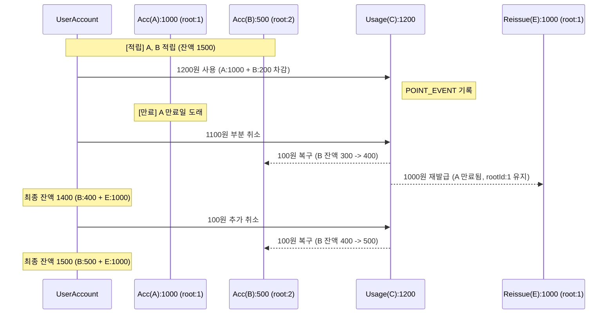

# 포인트 시나리오 흐름 및 DB 상태 변화

`PointServiceTest.detailedScenarioTest`에서 검증된 요구사항 예시 시나리오의 단계별 데이터 변화를 설명합니다.

## 시나리오 요약
1. **적립 A**: 1000원 적립
2. **적립 B**: 500원 적립 (총 1500원)
3. **사용 C**: 1200원 사용 (A: 1000, B: 200 차감 / 잔액 300원)
4. **만료**: 적립 A 만료 처리
5. **사용 취소 D**: 1100원 부분 취소 (총 1400원)
    - A(1000원) 복구 시도 -> 만료됨 -> **신규 적립 E** 발생
    - B(200원 중 100원) 복구 -> B 잔액 400원
6. **사용 취소 추가**: 남은 100원 추가 취소 (총 1500원)
    - B(남은 100원) 복구 -> B 잔액 500원

---

## 1. 초기 상태 (사용자 생성)

| 테이블 | 데이터 |
| :--- | :--- |
| **USER_ACCOUNT** | `userId: user1`, `remainingPoint: 0` |

---

## 2. 포인트 적립 (A, B)

### [Step 1] 1000원 적립 (별칭: A)
- **USER_ACCOUNT**: `remainingPoint: 1000`
- **POINT**:
  | id (PK) | pointKey | accumulatedPoint | remainingPoint | rootId | sourceType | expiryDateTime |
  | :--- | :--- | :--- | :--- | :--- | :--- | :--- |
  | 1 | `20260403000001` | 1000 | 1000 | 1 | ACCUMULATION | `2999-12-31T23:59:59` |

### [Step 2] 500원 적립 (별칭: B)
- **USER_ACCOUNT**: `remainingPoint: 1500`
- **POINT**:
  | id (PK) | pointKey | accumulatedPoint | remainingPoint | rootId | sourceType | expiryDateTime |
  | :--- | :--- | :--- | :--- | :--- | :--- | :--- |
  | 1 | `20260403000001` | 1000 | 1000 | 1 | ACCUMULATION | `2999-12-31T23:59:59` |
  | 2 | `20260403000002` | 500 | 500 | 2 | ACCUMULATION | `2999-12-31T23:59:59` |

---

## 3. 포인트 사용 (별칭: C, 1200원)

### [Step 3] 주문 A1234에서 1200원 사용
- **USER_ACCOUNT**: `remainingPoint: 300`
- **POINT**: (A 우선 소진)
  | id | pointKey | remainingPoint | rootId | expiryDateTime |
  | :--- | :--- | :--- | :--- | :--- |
  | 1 | `20260403000001` | **0** | 1 | `2999-12-31T23:59:59` |
  | 2 | `20260403000002` | **300** | 2 | `2999-12-31T23:59:59` |
- **ORDER**: (주문 마스터)
  | id (PK) | orderNo (UK) | orderedPoint | canceledPoint | regDateTime |
  | :--- | :--- | :--- | :--- | :--- |
  | 1 | **A1234** | 1200 | 0 | `2026-04-03T19:59:00` |
- **POINT_EVENT**: (상세 추적)
  | id (PK) | orderId (FK) | accumulationId (FK) | amount | detailType |
  | :--- | :--- | :--- | :--- | :--- |
  | 1 | 1 (C) | 1 (A) | 1000 | USE |
  | 2 | 1 (C) | 2 (B) | 200 | USE |

---

## 4. 포인트 만료 (A)

### [Step 4] 적립 A 만료 (임의 수정)
- **POINT**:
  | id | pointKey | remainingPoint | expiryDateTime |
  | :--- | :--- | :--- | :--- |
  | 1 | `20260330000001` | 0 | **`2026-03-29T21:11:00` (만료)** |

---

## 5. 사용 취소 (별칭: D, 1100원 부분 취소)

### [Step 5] C 사용 건 중 1100원 취소
- **USER_ACCOUNT**: `remainingPoint: 300 + 1100 = 1400`
- **ORDER**: `orderedPoint: 1200`, `canceledPoint: 1100`, `type: PARTIAL_CANCEL`
- **POINT**:
  | id | pointKey | remainingPoint | rootId | originId | sourceType | 비고 |
  | :--- | :--- | :--- | :--- | :--- | :--- | :--- |
  | 1 | `20260403000001` | 0 | 1 | null | ACCUMULATION | 만료됨 (복구 불가) |
  | 2 | `20260403000002` | **400** | 2 | null | ACCUMULATION | B의 사용분(200) 중 100원 복구 |
  | 3 | `20260403000003` | **1000** | 1 | 1 | AUTO_RESTORED | **A 취소분 1000원 재발급 (별칭: E)** |
- **POINT_EVENT**:
  | id | accumulationId | amount | detailType | 비고 |
  | :--- | :--- | :--- | :--- | :--- |
  | 5 | 2 (B) | 100 | USE_CANCEL | B 복구 |
  | 6 | 3 (E) | 1000 | REISSUE | E 생성 |
  | 7 | 1 (A) | 1000 | USE_CANCEL | A 취소 기록 |

---

## 6. 최종 상태 (남은 100원 추가 취소)

### [Step 6] C 사용 건 중 남은 100원 최종 취소
- **USER_ACCOUNT**: `remainingPoint: 1400 + 100 = 1500`
- **ORDER**: `orderedPoint: 1200`, `canceledPoint: 1200`, `type: TOTAL_CANCEL`
- **POINT**:
  | id | pointKey | accumulatedPoint | remainingPoint | rootId | sourceType | 비고 |
  | :--- | :--- | :--- | :--- | :--- | :--- | :--- |
  | 1 | `20260403000001` | 1000 | 0 | 1 | ACCUMULATION | 만료 |
  | 2 | `20260403000002` | 500 | **500** | 2 | ACCUMULATION | B의 남은 사용분 100원 복구 |
  | 3 | `20260403000003` | 1000 | 1000 | 1 | AUTO_RESTORED | 신규 적립 건 유지 |

---

## 시나리오 흐름도 (Mermaid)

