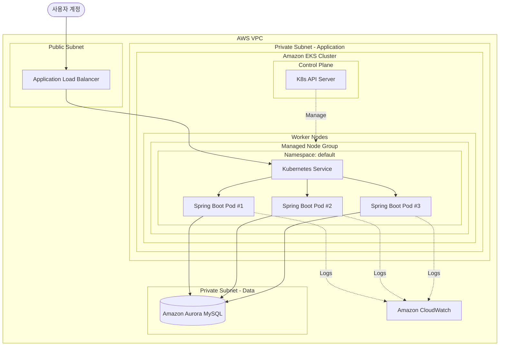

# AWS 아키텍처 구성

본 프로젝트를 AWS 기반으로 서비스한다고 가정했을 때의 아키텍처 구성을 설명합니다.

## 아키텍처 다이어그램 (Mermaid)

## 구성 요소 상세

1. **Compute: Amazon EKS**
   - **Control Plane**: AWS에서 관리하며, API Server, Scheduler, Controller Manager 등을 포함합니다.
   - **Worker Nodes**: 실제 Spring Boot 애플리케이션 컨테이너가 실행되는 EC2 인스턴스 그룹입니다.
   - Deployment를 통해 여러 Pod를 실행하고, 트래픽 증가 시 Replica 수를 확장할 수 있습니다.
   - 동일 사용자의 포인트 적립/사용/취소 요청이 몰릴 수 있으므로, 애플리케이션은 무상태(Stateless)로 구성하고 정합성은 DB 트랜잭션과 락 전략으로 보장합니다.

2. **Load Balancing: Application Load Balancer (ALB)**
   - 외부 사용자의 요청을 수신하여 EKS 내부 Service로 전달합니다.
   - AWS Load Balancer Controller를 통해 Ingress 자원을 ALB로 프로비저닝합니다.
   - SSL/TLS 종료 지점으로 활용할 수 있습니다.

3. **Application Routing: Kubernetes Service & Ingress**
   - 클러스터 내부에서 Spring Boot Pod들을 하나의 논리적 엔드포인트로 노출합니다.
   - Ingress를 통해 외부 트래픽을 Service로 라우팅합니다.

4. **Database: Amazon Aurora MySQL (Multi-AZ)**
   - 포인트 적립, 사용, 취소, 사용취소와 같은 원장성 데이터를 영속적으로 저장합니다.
   - 트랜잭션 정합성이 중요한 시스템이므로, 사용자 포인트 변경은 DB 트랜잭션 단위로 처리합니다.
   - Multi-AZ 구성을 통해 장애 상황에서도 가용성을 확보합니다.

5. **Monitoring & Logs: Amazon CloudWatch**
   - Fluent Bit 등을 사용하여 Pod의 로그를 CloudWatch Logs로 전송합니다.
   - Container Insights를 통해 클러스터 및 Pod 메트릭을 수집합니다.